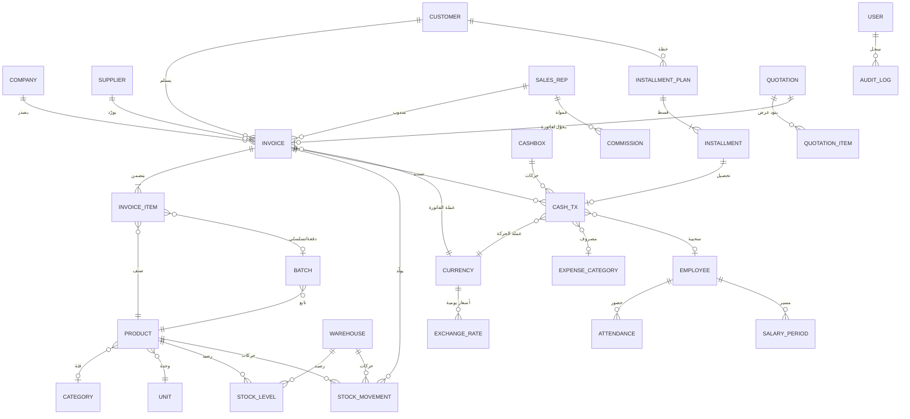

# وثيقة المواصفات الهندسية الكاملة (SRS)

## تطبيق «المُحاسِب الشخصي» — نظام محاسبي ومخزون متكامل لأجهزة الأندرويد

| البند | القيمة |
|---|---|
| **اسم الوثيقة** | وثيقة المواصفات — التطبيق المحاسبي الشخصي |
| **الإصدار** | 1.1 |
| **التاريخ** | 2026-10-05 |
| **الحالة** | معتمدة للتنفيذ |
| **المنصة المستهدفة** | Android (أساسي) — قابل للتوسّع لاحقاً إلى Windows |
| **التقنية المعتمدة** | React Native + Expo (مع Expo Go للتطوير وEAS Build للإنتاج) |
| **بيئة التطوير المتحققة** | وكيل Super Z: تطوير RN/Expo مباشر داخل بيئة الوكيل بمعاينة ويب عبر التصدير الثابت (Expo SDK 54) — وجهاز المستخدم: Expo Go للتجربة الفعلية وEAS Build لإنتاج APK |
| **السوق المستهدف** | الجمهورية اليمنية (مع دعم تعدد العملات) |
| **لغة الواجهة** | العربية فقط (RTL كامل) |
| **نموذج الاستخدام** | شخصي/فردي — بدون اشتراكات أو شراء داخل التطبيق |
| **المرجع** | تحليل ثابت (Static Analysis) لتطبيق «المحاسب المالي» v1.9.7 من تميز سوفت + تحليل صفحة المتجر و69 لقطة شاشة (8 أساسية + 61 تفصيلية محلّلة في «دليل الشاشات المرجعي») |

> **سجل التغييرات** — **v1.1** (2026-10-05): توثيق نتائج التحقق العملي لبيئة التطوير — إضافة القسم 3.6 (بيئة التطوير المتحققة)، تحديث الملخص التنفيذي (1.5) والقيود (3.5) وNFR-09/NFR-12 والأقسام 8–9 وملحق أ/ج، وتحديث المرجع بالدليل المرجعي للشاشات. **v1.0** (2026-10-05): الإصدار الأول الكامل.

---

## 1. مقدمة الوثيقة

### 1.1 الغرض

توثّق هذه الوثيقة المتطلبات الوظيفية وغير الوظيفية، ومعمارية النظام، ونموذج البيانات، ومواصفات التصميم لتطبيق محاسبي عربي متكامل يُبنى من الصفر بواسطة **React Native + Expo**. الوثيقة مكتوبة بحيث تصلح مرجعاً مباشراً للمطوّر (أو لفريق تطوير) دون حاجة لأي مستند إضافي: كل ميزة لها رقم متطلب قابل للتتبّع، وكل جدول قاعدة بيانات له مخطط SQL كامل، وكل شاشة لها وصف تفصيلي.

### 1.2 النطاق

يُبنى التطبيق كبديل شخصي كامل الوظائف عن تطبيق «المحاسب المالي | فواتير مبيعات» الشهير، ويشمل: الفوترة الإلكترونية، إدارة المخزون متعدد المخازن، العملاء والموردين، التقسيط، الصناديق النقدية، المناديب، شؤون الموظفين، تعدد العملات مع أسعار صرف يومية، التقارير المالية، الطباعة الحرارية عبر البلوتوث، إرسال الفواتير عبر واتساب، والنسخ الاحتياطي. **يُستثنى** من النطاق كل ما يتعلق بالترخيص التجاري: الاشتراكات، الشراء داخل التطبيق، تفعيل الباقات، وربط الجهاز — إذ إن التطبيق للاستخدام الشخصي فقط.

### 1.3 جمهور الوثيقة

- **المطوّر المنفّذ** (أنت أو أي مطوّر مستقبلي): كل أقسام الوثيقة.
- **أدوات التطوير المساندة بالذكاء الاصطناعي** (Cursor / Copilot / Claude): الوثيقة صيغت بصيغة Markdown قياسية بحيث يمكن تغذيتها مباشرة كمرجع سياق (Context) أثناء كتابة الكود.

### 1.4 اصطلاحات الترقيم

- `FR-XX-YY`: متطلب وظيفي (Functional Requirement) — XX رقم الوحدة، YY رقم المتطلب.
- `NFR-XX`: متطلب غير وظيفي.
- `DS-XX`: بند في مواصفات التصميم.
- كلمات الإلزام: **يجب** (إلزامي)، **ينبغي** (موصى به)، **يمكن** (اختياري).

### 1.5 ملخص تنفيذي

يهدف المشروع إلى بناء نظام محاسبي عربي يعمل **دون اتصال بالإنترنت بشكل أساسي** (Offline-First)، يخزّن بياناته محلياً في قاعدة **SQLite** على الجهاز، مع طبقة **نسخ احتياطي سحابي اختيارية** عبر Supabase. اختير React Native + Expo لأنه يتيح تجربة التطبيق فوراً على الهاتف عبر Expo Go بمسح رمز QR، وبناء ملف APK نهائي سحابياً عبر EAS Build دون أي إعداد محلي معقّد (لا حاجة لـ Android Studio). التحليل الثابت للتطبيق المرجعي كشف أن الأخير مبني بـ Flutter مع Firebase — وهذا يعني أن كل ميزة في المنافس **قابلة للتنفيذ بمكافئات ناضجة في React Native**، والوثيقة تتضمن جدول ترجمة كامل لكل مكوّن (القسم 3.4). النطاق الزمني المقدَّر للنسخة الكاملة: **14–18 أسبوع عمل** لفرد واحد بدوام جزئي (تفصيل الخطة في القسم 9).

> **تحديث v1.1 — التحقق العملي من بيئة التطوير**: جرى التحقق فعلياً (2026-10-05) داخل بيئة وكيل Super Z من قابلية تطوير React Native/Expo مباشرة دون محاكي أندرويد ودون Android Studio: مشروع `finacc-mobile/` (Expo SDK 54 + expo-router + react-native-web) يعمل، وشاشة فاتورة مبيعات عربية RTL تفاعلية (خط Tajawal، ثيم كحلي/فيروزي، بنود وكميات وخصم وإجمالي، حفظ نقدي/آجل مع تأكيد) صُمِّمت وشُغِّلت في المتصفح عبر التصدير الثابت، مع فحص آلي للتفاعل وتحقق بصري من سلامة الاتجاه والثيم. حلقة العمل داخل الوكيل: تعديل الكود ثم تصدير ثابت (~90 ثانية) ثم معاينة وتفاعل من المتصفح؛ وتبقى تجربة الجهاز الفعلي عبر Expo Go وإنتاج APK عبر EAS Build على جهاز المستخدم عند المعالم. التفصيل الكامل في القسم 3.6.

---

## 2. تحليل التطبيق المرجعي (نتائج التحليل الثابت)

> هذا القسم يلخّص ما اكتُشف فعلياً من تفكيك حزمة التطبيق الأصلي (نسخة ويندوز الرسمية — نفس الكود والمطور، إذ التطبيق واحد متعدد المنصات). هذه النتائج هي أساس كل متطلب في هذه الوثيقة.

### 2.1 المعمارية المكتشفة للتطبيق الأصلي

| الطبقة | تقنية المنافس المكتشفة | الدليل من التحليل |
|---|---|---|
| إطار الواجهة | **Flutter** (Dart, AOT) | `flutter_windows.dll` 20MB + `app.so` (AOT Snapshot) + `flutter_assets/` |
| المصادقة والسحابة | **Firebase Auth + Cloud Firestore + Messaging** | `firebase_auth_plugin.lib`, `cloud_firestore_plugin.lib`, معرّف المشروع `accountant-8b3c4` |
| قاعدة البيانات المحلية | **SQLite عبر FFI** | `sqlite3.dll` + `NativeAssetsManifest.json` → `package:sqlite3/src/ffi` |
| الطباعة الحرارية | حزمتان: **thermal_printer** + **print_bluetooth_thermal** | DLLs بنفس الأسماء + `win_ble` (بلوتوث ويندوز) |
| توليد وطباعة PDF | **printing + pdfx + pdfium** + خط Cairo | `pdfx_plugin.dll`, `pdfium.dll` 4.2MB, `Cairo-Regular.ttf` |
| التخزين المشفّر | **flutter_secure_storage** | `flutter_secure_storage_windows_plugin.dll` |
| المصادقة الحيوية | **local_auth** (بصمة/Windows Hello) | `local_auth_windows_plugin.dll` |
| تمييز الجهاز | **flutter_udid** | `flutter_udid_plugin.dll` (لربط الترخيص بالجهاز — لن نحتاجه) |
| المشاركة | **share_plus + url_launcher** (واتساب/SMS) | DLLs + `wa.me/` في السلاسل النصية |
| الملفات | **file_saver + file_selector + gal** | DLLs الثلاثة |
| إكسل | **XLSX تصدير واستيراد** (OpenXML) | مخططات `spreadsheetml` + نصوص «الاكسل بصيغة…»، «الأعمدة المراد استيرادها» |
| الصوت | **flutter_soloud** (صوت beep عند مسح الباركود) | `flutter_soloud_plugin.dll` + `beep.wav` |
| منع نوم الشاشة | **wakelock_plus** | `no_sleep.js` في الأصول |
| الإشعارات المحلية | **flutter_local_notifications** | DLL + منصة الويب |
| المونيتيزيشن | ترخيص + باقات + شراء داخل المتجر | `windows_store_purchase_plugin.dll` + سلاسل `LicenseCheckMode`, `licenseMissingOrInvalid`, «الباقة»، «التجريبي» |

### 2.2 كيانات العمل المكتشفة من الكود المترجم

من سلاسل `app.so` (الكود المترجم AOT) استُخرجت أسماء الكيانات التالية، وهي تعكس بنية قاعدة بيانات المنافس:

`Invoice`, `InvoicesTax`, `InvoicePayType`, `Supplier`, `SupplierReceiptPayType`, `Product`, `ProductsBatchNumber`, `ProductsSerialNumber`, `Expenses`, `Employee`, `EmployeeAttendanceDecisionType`, `Payment`, `PaymentOption`, `Company`, `Settings`, `Users`, `installments_channel`, `expenses_report_r`

**الاستنتاجات المعمارية المهمة:**
1. الدفعات (`BatchNumber`) والأرقام التسلسلية (`SerialNumber`) في المنتجات → دعم تتبّع الدفعات للأصناف (مهم في السوق اليمني للأدوية/الإلكترونيات).
2. وجود `InvoicePayType` و`SupplierReceiptPayType` ككيانات مستقلة → أنواع الدفع (نقدي/آجل/معلّق) مُنفّذة كنماذج مرجعية لا كحقول نصية.
3. `installments_channel` → الأقساط لها قناة إشعارات (تذكيرات استحقاق الأقساط).
4. كيان `Company` مستقل عن `Settings` → إمكانية تعدد الشركات/المنشآت في الأصل (سنبسّطها لشركة واحدة في V1 مع بنية تسمح بالتوسّع).

### 2.3 خريطة الميزات المؤكدة (من 3,434 نصاً عربياً مستخرجاً)

الميزات التالية مؤكدة بالأدلة النصية من الكود، مرتبة حسب قوة التأكيد:

| الميزة | تكرار الكلمات الدالة | حكم الوثيقة |
|---|---|---|
| المخازن والمخزنية | 9 مواضع | تُدمج كوحدة كاملة (FR-01) |
| الطباعة والطابعات + البلوتوث | 16 موضعاً | وحدة الطباعة (FR-10) |
| العملات | 12 موضعاً | وحدة العملات (FR-08) |
| الضريبة والضريبية | 6 مواضع | مدمجة في الفوترة (FR-02) |
| الصلاحيات | 5 مواضع | مستخدمون محليون بأدوار (FR-12) |
| الأرباح | 5 مواضع | تقارير الربح (FR-09) |
| التقسيط والأقساط | 8 مواضع | وحدة التقسيط (FR-05) |
| النسخ الاحتياطي والسحابة | 6 مواضع | وحدة النسخ (FR-11) |
| الإرجاع/المرتجعات | 5 مواضع | فواتير مرتجع (FR-02) |
| حضور الموظفين + السحبيات | 6 مواضع | وحدة الموظفين (FR-07) |
| واتساب | 3 مواضع | مشاركة الفواتير (FR-10) |
| الباركود | 3 مواضع | مسح وتوليد (FR-01, FR-02) |
| التذكيرات | موضعان | إشعارات الأقساط (FR-05) |
| تقرير يومي/شهري/سنوي | 9 مواضع | دورية التقارير (FR-09) |
| العملة الورقية «السحبيات» | 3 مواضع | سلف الموظفين من الصندوق (FR-07) |
| إكسل (استيراد/تصدير) | مؤكد بـ OpenXML | تصدير التقارير والاستيراد (FR-09, FR-01) |

### 2.4 عناصر واجهة اكتُشفت من الأصول

من مجلد `images/` في الحزمة: شاشات Onboarding متعددة (onboard1/3/4/7/8/9 + أنيميشن تسجيل `signup_anim.json`)، صور وظيفية لكل وحدة (فاتورة، فاتورة مرتجعة `invoiceReturned.png`، صندوق `safe.png`، مندوب `direct-marketing.png`، مورّد `supplier_big.png`، مخزن `store_big.png`، عامل كاشير `cashier.png`، سحب نقدي `withdrawal.png`)، رموز عملات SVG (ريال سعودي، درهم إماراتي، ريال عماني)، شعار بنك الراجحي (وسيلة دفع اشتراكات — لن نحتاجه)، وأصوات (`beep.wav` لمسح الباركود، أصوات نجاح/فشل الرفع والتنزيل للنسخ السحابي، أنيميشن نجاح/فشل Lottie).

---
## 3. معمارية النظام المقترحة

### 3.1 نظرة عامة — Offline-First

**القرار المعماري الجوهري: التطبيق يعمل محلياً أولاً (Offline-First).** قاعدة البيانات الأساسية هي SQLite على الجهاز نفسه، وكل الوظائف (فوترة، مخزون، تقارير، طباعة) تعمل بلا إنترنت إطلاقاً. الإنترنت يُستخدم فقط لثلاث وظائف اختيارية: النسخ الاحتياطي السحابي، المزامنة بين الأجهزة، وإرسال الفواتير عبر واتساب (المشاركة نفسها تتم عبر تطبيق واتساب المثبّت).

هذا القرار مبني على ثلاث حقائق:
1. **السوق اليمني** يعاني من انقطاع إنترنت متكرر، والتطبيقات المحاسبية هناك تعمل في محلات قد لا تملك إنترنت أصلاً.
2. **الخصوصية**: بياناتك المالية تبقى على جهازك، ولا طرف ثالث يراها إلا عند تفعيل النسخ السحابي يدوياً.
3. **البساطة**: لا حاجة لمصادقة معقّدة أو قواعد أمان سحابية، فالتطبيق شخصي.

```
┌─────────────────────────────────────────────────────────┐
│                    React Native + Expo                    │
│  ┌───────────────┐  ┌──────────────┐  ┌───────────────┐  │
│  │  UI Layer      │  │ State (Zustand│  │ Navigation   │  │
│  │  RTL Arabic    │  │ + TanStack Q │  │ expo-router   │  │
│  │  Tamagui/RNPaper│  └──────────────┘  └───────────────┘  │
│  └───────────────┘                                        │
│  ┌─────────────────────────────────────────────────────┐ │
│  │            Domain / Business Logic (TS)             │ │
│  │  Invoicing • Inventory • Installments • Reports     │ │
│  └─────────────────────────────────────────────────────┘ │
│  ┌──────────────────────┐  ┌───────────────────────────┐ │
│  │  expo-sqlite (drizzle)│  │ Sync/Backup (اختياري)      │ │
│  │  SQLite DB محلياً     │  │ Supabase REST + Storage   │ │
│  └──────────────────────┘  └───────────────────────────┘ │
│  ┌─────────────────────────────────────────────────────┐ │
│  │ الأجهزة:expo-camera(باركود)• BLE(طابعة)• طباعة PDF  │ │
│  └─────────────────────────────────────────────────────┘ │
└─────────────────────────────────────────────────────────┘
```

### 3.2 قرار الخلفية السحابية — التوصية المطلوبة منك

> سألتني: «ما الخلفية السحابية الأنسب التي تقترحها؟» — جوابي بعد مقارنة الخيارات الثلاثة:

| المعيار | **Supabase (توصيتي)** | Firebase (نفس المنافس) | بدون سحابة (ملفات فقط) |
|---|---|---|---|
| نموذج البيانات | **PostgreSQL** — SQL قياسي يطابق عقلية SQLite المحلية: نفس لغة الاستعلام | Firestore NoSQL — نموذج مختلف كلياً عن SQLite، تعليمه وتحويل البيانات له عبء إضافي | — |
| الخطة المجانية | 500MB تخزين ملفات + قاعدة بيانات 500MB + 50MB — تكفي لسنوات من بياناتك | Firestore مجاني 1GB + 50K قراءة/يوم — حسّاء الفواتير قد تستهلكه | — |
| التصدير والملكية | **تصدير كامل بصيغة SQL قياسية** — بياناتك ملكك بأي وقت | التصدير يتطلب أدوات خاصة | نسخ ملفات يدوي |
| المزامنة | جدولة يدوية/دورية عبر REST (بسيطة ومفهومة) | Realtime فوري | لا مزامنة |
| مكتبة React Native | `@supabase/supabase-js` — **JavaScript خالص، يعمل مع Expo فوراً** | `@react-native-firebase` يتطلب Dev Build لا Expo Go | — |
| الاعتمادية | مفتوح المصدر، يمكن استضافته ذاتياً لاحقاً | مغلق، مرتبط بجوجل نهائياً | — |

**التوصية النهائية: معمارية هجينة — `SQLite محلياً` + `Supabase للنسخ الاحتياطي والمزامنة (اختياري)`.**

مبرّرات القرار بالتفصيل:
1. **التطابق العقلي**: قاعدة بياناتك المحلية SQL وقاعدة بياناتك السحابية SQL — نفس المفاهيم (جداول، مفاتيح، JOIN)، فالكود المشترك في الطبقتين أكبر والتعلم أسرع. مع Firestore كنتَ ستتعلم نموذج مستندات/مجموعات جديداً بالكامل.
2. **البساطة مع Expo**: مكتبة Supabase هي JS خالص تعمل داخل Expo Go مباشرة أثناء التطوير، بينما مكتبة Firebase الرسمية تتطلب بناء تطوير مخصص (Dev Client) — وهذا يعقّد مرحلة التجربة الأولى التي هي أهم ميزة في Expo.
3. **النطاق الشخصي**: لستَ بحاجة لـ Realtime أو دوال سحابية؛ تحتاج فقط رفع نسخة والتنزيل عند الحاجة — وهذا ما تفعّله REST بطلبات قليلة.
4. **النسخ الاحتياطي كسجل تاريخي**: سنبني النسخ السحابية كـ Snapshot كامل (ملف قاعدة مضغوط يرفع إلى Supabase Storage) لا كمزامنة تفاضلية — أبسط بنية وأكثر أماناً للاستخدام الشخصي (تفصيل في FR-11).

### 3.3 قرار التنفيذ: قاعدة البيانات المحلية

- **المحرّك**: `expo-sqlite` (يدعم expo-sqlite Sync/Async API).
- **طبقة الاستعلام**: `drizzle-orm` مع `drizzle/expo-sqlite` — تعريف المخطط بـ TypeScript، أنواع آمنة تلقائياً، هجرات (Migrations) مولّدة. البديل المقبول: كتابة SQL خام داخل مستودع (Repository) واحد — لكن Drizzle يقلل الأخطاء ويعطي أنواعاً كاملة.
- **التسمية**: أسماء الجداول بالإنجليزية snake_case (توافق مع أدوات SQL)، وكل النصوص الظاهرة بالعربية.
- **الهجرات**: كل تغيير مخطط = ملف هجرة جديد (يُخزن في `drizzle/migrations/`) مع تسجيل إصداره في جدول `_migrations` — يسمح بترقية التطبيق دون فقدان البيانات.

### 3.4 حزمة التقنيات — جدول ترجمة كل مكوّن من المنافس إلى مكافئنا

| الوظيفة | مكوّن المنافس (Flutter) | **مكافئنا (React Native + Expo)** | ملاحظات |
|---|---|---|---|
| الإطار | Flutter | **React Native 0.76+ + Expo SDK 52+** | New Architecture مفعّلة افتراضياً |
| اللغة | Dart | **TypeScript** (صارم: `strict: true`) | |
| التنقل | go_router المتضمّن | **expo-router** (مجلدات + Deep Linking مجاناً) | |
| واجهة المستخدم | Material | **react-native-paper** + مكونات مخصصة | Dark Theme RTL |
| الحالة | — | **zustand** + **@tanstack/react-query** | Query للاستعلامات من SQLite |
| قاعدة البيانات | sqlite3 (FFI) | **expo-sqlite + drizzle-orm** | نفس المفهوم |
| الباركود | — | **expo-camera** (مدمج الباركود!) + **expo-barcode-generator** (توليد) | الكاميرا تقرأ EAN13/Code128/QR دون وحدة خارجية |
| الطابعة الحرارية | thermal_printer | **react-native-thermal-printer** (BLE/USB/شبكة) | يتطلب Dev Build بعد اكتمال التطوير — تفاصيل القسم 3.5 |
| PDF | printing + pdfx | **expo-print + expo-sharing** (HTML→PDF) | دعم عربي كامل بخط مضمّن |
| إكسل | openxml يدوي | **xlsx (SheetJS)** | قراءة وكتابة XLSX/CSV بـ JS خالص |
| الأمان الحيوي | local_auth | **expo-local-authentication** | بصمة/نمط/PIN |
| تخزين مشفّر | flutter_secure_storage | **expo-secure-store** | مفاتيح ورمز القفل |
| إشعارات محلية | flutter_local_notifications | **expo-notifications** | تذكيرات الأقساط |
| مشاركة واتساب | share_plus + url_launcher | **expo-sharing + expo-linking** | wa.me/ رابط مباشر |
| ملفات | file_saver + file_selector | **expo-file-system + expo-document-picker + expo-media-library** | حفظ/اختيار/معرض |
| العملات SVG | عملات مرسومة | **react-native-svg** | رموز العملات SVG |
| صوت المسح | flutter_soloud | **expo-av** (تشغيل beep.wav) | |
| منع النوم | wakelock_plus | **expo-keep-awake** | أثناء شاشة الكاشير |
| الطرفية السحابية | firebase_* | **@supabase/supabase-js** | النسخ الاحتياطي فقط (اختياري) |
| الخطوط العربية | Tajawal + Cairo + … | **@expo-google-fonts/tajawal + cairo** | نفس خطوط المنافس تقريباً! |

### 3.5 قيود تقنية يجب معرفتها مسبقاً

1. **Expo Go مقابل Dev Build**: 90% من الوثيقة (كل شيء عدا الطابعة الحرارية) يعمل في **Expo Go** عبر QR فوراً. مكتبة الطباعة الحرارية `react-native-thermal-printer` وحدة Native تتطلب **Dev Client** أو **EAS Build** (ملف APK جاهز). خطة التطوير: بناء كل شيء والتجربة في Expo Go، وفي نهاية كل مرحلة بناء APK عبر EAS Build لاختبار الطباعة على الجهاز الفعلي.
2. **الطباعة العربية الحرارية**: طابعات ESC/POS الحرارية الرخيصة الشائعة في اليمن (Xprinter, POS-58, Sunmi) تدعم غالباً ترميز CP720/CP1256 للعربية أو لا تدعم العربية إطلاقاً. الاستراتيجية المعمارية: الطباعة الافتراضية **كصورة نقطية (Raster)** للفاتورة العربية الكاملة (مضمونة 100% على أي طابعة)، مع خيار نص ESC/POS للإنجليزية/الأرقام للسرعة. (تفصيل FR-10.4)
3. **حجم التطبيق النهائي**: APK متوقع 55–75MB (مقابل 28MB للمنافس) بسبب محرك React Native — مقبول تماماً لتطبيق محاسبي.
4. **الأداء**: كل عمليات القاعدة عبر فهارس (Indexes) محددة في المخطط؛ الحسابات التجميعية (التقارير) عبر SQL لا في JS.
5. **بيئة وكيل Super Z (متحقق عملياً — v1.1)**: يمكن أن يجري التطوير بالكامل داخل بيئة الوكيل: تثبيت الحزم عبر bun (ثوانٍ)، والمعاينة عبر تصدير ويب ثابت `expo export --platform web` (~90 ثانية) ثم فحص الرندر والتفاعل من متصفح آلي. غير المتاح داخل بيئة الوكيل: خادم Metro حي (HMR)، محاكي أندرويد (لا KVM)، EAS Build (يتطلب حساب Expo) — لذلك يُنتَج APK على جهاز المستخدم عند نهاية كل مرحلة. التفصيل الكامل والحدود والبدائل في القسم 3.6.

### 3.6 بيئة التطوير المتحققة عملياً وحلقة العمل اليومية

> أُضيف في v1.1 بناءً على تجربة عملية ناجحة (2026-10-05) داخل بيئة وكيل Super Z. الخلاصة: **نعم — يمكن تطوير React Native/Expo داخل بيئة الوكيل مباشرة** والمعاينة من المتصفح عبر التصدير الثابت، دون محاكي أندرويد ودون Android Studio.

**ما نُفِّذ فعلياً في التجربة (سجل الأدلة):**

| # | الخطوة | النتيجة المتحققة |
|---|---|---|
| 1 | تهيئة المشروع يدوياً (تجاوزاً لتجمّد `create-expo-app` داخل البيئة) | Expo SDK 54.0.37 + expo-router 6 + react-native-web 0.21 + React Native 0.81.5 + TypeScript |
| 2 | تثبيت كامل الاعتماديات عبر bun | ~2.7 ثانية |
| 3 | بناء شاشة فاتورة مبيعات عربية RTL كاملة | خط Tajawal (3 أوزان)؛ ثيم كحلي/فيروزي مطابق للقسم 6.1؛ بنود تفاعلية بتحكم الكميات؛ بحث/باركود؛ بطاقة عميل؛ خصم تجريبي 2%؛ ضريبة 0% (السوق اليمني)؛ إجمالي؛ حفظ نقدي/آجل مع رسالة تأكيد |
| 4 | `npx expo export --platform web` | حزمة ويب ثابتة (باندل ~1.04MB) في ~90 ثانية |
| 5 | دمج التصدير في مسار `/rn/` للمعاينة | تصحيح RTL في HTML + تحويل المسارات المطلقة + حقن `replaceState` — عبر سكربت قابل للتكرار: `scripts/build-rn-web.sh` |
| 6 | فحص آلي من المتصفح (agent-browser) | الرندر كامل داخل إطار المعاينة + التفاعل مؤكد: نقر زر «حفظ نقدي» أطلق رسالة التأكيد |
| 7 | تحقق بصري عبر نموذج رؤية (VLM) | عربية RTL سليمة؛ ثيم داكن كحلي/فيروزي مطابق للمواصفة |

**حلقة التطوير الملزمة داخل بيئة الوكيل (بديل HMR):**

```text
(1) تعديل الكود — Domain ثم Data ثم UI
(2) bash scripts/build-rn-web.sh — تصدير + تصحيحات + دمج (حوالي 90 ثانية)
(3) معاينة في المتصفح + تفاعل آلي (نقر / إدخال / تمرير)
(4) مقارنة بصرية اختيارية مع لقطات التطبيق المرجعي (61 لقطة) عبر VLM
(5) تكرار الدورة حتى اكتمال الميزة
```

**حدود البيئة وما يقابلها من بدائل:**

| غير متاح داخل بيئة الوكيل | السبب | البديل المعتمد |
|---|---|---|
| خادم Metro حي / HMR | العمليات الخلفية لا تبقى حية بين الأوامر | حلقة التصدير الثابت أعلاه (~90 ثانية للدورة) |
| محاكي أندرويد | لا KVM في البيئة | معاينة الويب للواجهة والمنطق؛ اختبار الجهاز الفعلي عبر Expo Go على هاتف المستخدم |
| EAS Build | يتطلب حساب Expo وتسجيل دخول | يُشغَّل من جهاز المستخدم عند المعالم: `npx eas build -p android` — الكود جاهز للنقل 100% |
| Expo Go عبر نفق | لا نفق مستقر بين البيئة والهاتف | التصدير الثابت هو واجهة المعاينة داخل الوكيل |

**الأثر الاستراتيجي (تصحيح المسار)**: بما أن كود React Native نفسه يعمل في الويب عبر react-native-web (متحقق أعلاه)، فإن أي حاجة مستقبلية لنسخة ويب أو PWA تُلبّى من **نفس هذا المشروع** بأمر تصدير واحد — دون بناء مشروع React DOM منفصل يستهلك جهداً موازياً ويقطع قابلية النقل إلى APK. طبقة Domain (NFR-11) تبقى نقية بلا أي استيراد من `react-native`، فتعمل في الويب وعلى الجهاز وفي اختبارات Jest بلا تعديل.

**حالة المشروع الفعلية عند إصدار v1.1**: مشروع `finacc-mobile/` مهيأ ويعمل وفق هذا القسم، وواجهة شاشة فاتورة المبيعات منجزة ومعاينة في المتصفح — وهي نواة مبكرة للمرحلة 2 من خطة التنفيذ (القسم 9). المتبقي لإغلاق المرحلة 0: مخطط Drizzle كاملاً + الهجرات + شاشات Onboarding وPIN.

---
## 4. المتطلبات الوظيفية — FR

> كل متطلب مرقّم وقابل للاختبار. أثناء التنفيذ تُحوَّل هذه المتطلبات إلى قائمة مهام (Issues) مباشرة.

### الوحدة 01 — الأصناف والمخزون (Inventory)

**الوصف العام**: إدارة كاملة للأصناف من تعريفها وحتى جرد مخازنها، مع تتبّع الكميات لكل مخزن على حدة، وتسعير بعملات متعددة يُحدَّث تلقائياً بسعر الصرف.

| الرمز | المتطلب | الأولوية |
|---|---|---|
| FR-01-01 | **يجب** أن يُضاف صنف بالحقول: اسم (عربي، إلزامي)، باركود (فريد إن أُدخل)، فئة، وحدة قياس، سعر تكلفة، سعر بيع (لكل عملة مفعّلة)، كمية افتتاحية، حد أدنى للتنبيه، ملاحظات، صورة (اختياري) | أساسية |
| FR-01-02 | **يجب** توليد باركود تلقائياً (EAN-13) للصنف عند ترك الحقل فارغاً، مع دعم توليد رمز QR للصنف | أساسية |
| FR-01-03 | **يجب** دعم مسح الباركود بالكاميرا (expo-camera) مع صوت «بيب» عند القراءة الناجحة وفتح شاشة الصنف فوراً — من أي شاشة عبر زر مسح عائم | أساسية |
| FR-01-04 | **يجب** دعم البحث الفوري في الأصناف بالاسم أو الباركود (فهرس FULL TEXT أو LIKE مفهرس) مع نتائج < 100ms لقاعدة 10,000 صنف | أساسية |
| FR-01-05 | **يجب** إدارة فئات الأصناف (شجرة بعمودين كحد أقصى) ووحدات القياس (قطعة، كرتون، كيلو، لتر…) مع **تحويل الوحدات** (1 كرتون = 24 قطعة) | مهمة |
| FR-01-06 | **يجب** دعم **المخازن المتعددة**: كل صنف له رصيد مستقل في كل مخزن، والشاشة الرئيسية للمخزون تعرض الرصيد الكلي + رصيد كل مخزن | أساسية |
| FR-01-07 | **يجب** تسجيل كل حركة مخزون (شراء، بيع، مرتجع بيع، مرتجع شراء، جرد، تحويل مخزن، تعديل يدوي) في جدول `stock_movements` مرجعي لا يُحذف (سجل دائم) | أساسية |
| FR-01-08 | **يجب** دعم **الجرد الذكي**: شاشة جرد للمخزن المحدد تعرض الرصيد الدفتري وإدخال الرصيد الفعلي، وتولّد تلقائياً تسوية (فرق زيادة/نقص) كحركة جرد موقّعة بتاريخ المستخدم واسم الجانِد | مهمة |
| FR-01-09 | **يجب** دعم تحويل المخزون بين المخازن (طلب تحويل: من مخزن إلى مخزن بكمية وملاحظة) | مهمة |
| FR-01-10 | **يجب** دعم **الدفعات (Batch) والأرقام التسلسلية** للأصناف المعلّمة «يتتبّع دفعات»: عند الشراء تُدخل رقم الدفعة/تاريخ الانتهاء، وعند البيع تُخصم من الدفعة الأقدم (FEFO) أو المحددة يدوياً | مهمة |
| FR-01-11 | **يجب** أن تُحدَّث أسعار البيع **بجميع العملات تلقائياً** عند تغيير سعر صرف عملة (زائد هامش قابل للضبط % لكل عملة) مع سجل بالأسعار قبل/بعد | مهمة |
| FR-01-12 | **يجب** تنبيه الرصيد الأدنى: أي صنف يهبط رصيده الكلي تحت حده الأدنى يظهر في شاشة «تنبيهات المخزون» بإشعار محلي يومي (9 صباحاً) لو مفعّل | مهمة |
| FR-01-13 | **يجب** دعم استيراد أصناف من ملف **Excel/CSV**: اختيار الأعمدة المطابقة (اسم/باركود/سعر/كمية) قبل الاستيراد + تقرير بالصفوف الناجحة/الفاشلة | مهمة |
| FR-01-14 | **يجب** أن تُعرض أصول الصنف كالتاريخ المعدّل والتعديلات (سجل تدقيق) | ثانوية |
| FR-01-15 | **يجب** منع حذف صنف له حركات مخزون — البديل: أرشفة الصنف (يختفي من القوائم الجديدة ويبقى في التقارير) | أساسية |

### الوحدة 02 — الفوترة (Invoicing)

**الوصف العام**: قلب التطبيق. فواتير بيع/شراء/مرتجع بأنواع دفع (نقدي/آجل/معلّق) مع ضريبة قيمة مضافة وخصومات، تعمل بلا إنترنت، وتُحدّث المخزون والصناديق والحسابات آلياً.

| الرمز | المتطلب | الأولوية |
|---|---|---|
| FR-02-01 | **يجب** إنشاء فاتورة بيع بالحقول: رقم تسلسلي (بادئة + ترقيم سنوي متسلسل لا يُعاد)، التاريخ (قابل للتعديل)، العميل، الصندوق، المندوب (اختياري)، العملة وسعر الصرف يومها، البنود | أساسية |
| FR-02-02 | **يجب** أن يُضاف بند للفاتورة عبر: مسح باركود (الكمية 1 + ضغطة تعيد المسح)، بحث اسم، أو «الشاشة السريعة». مع تعديل الكمية/السعر/الخصم لكل بند وحساب الإجمالي لحظياً | أساسية |
| FR-02-03 | **يجب** دعم **ثلاث حالات دفع**: نقدي (يسدد فوراً من صندوق)، آجل (على حساب العميل)، معلّق (محفوظة بلا أثر مالي/مخزوني حتى تحويلها) | أساسية |
| FR-02-04 | **يجب** دعم ضريبة القيمة المضافة: نسبة قابلة للضبط (0% افتراضياً لليمن، 5%/15% متاحة)، تُحسب لكل بند أو على الإجمالي (حسب الإعداد)، وتظهر مفصّلة في الفاتورة والتقارير الضريبية | أساسية |
| FR-02-05 | **يجب** دعم الخصومات: خصم على البند (%) أو مبلغ ثابت، وخصم على إجمالي الفاتورة، مع منع الخصم تحت صافي الربح المحدد في الإعدادات (اختياري) | مهمة |
| FR-02-06 | **يجب** أن تُخصم الكميات من المخزون المحدد فور حفظ فاتورة البيع (وليس المرتجع) وأن تُعاد مع المرتجع — داخل **Transaction** واحدة ذرّية (فاتورة + حركات + قيود) | أساسية |
| FR-02-07 | **يجب** دعم فاتورة **مرتجع بيع** (مرتبطة بفاتورة أصلية أو حرة): إعادة الكمية للمخزون، إعادة المبلغ للعميل (نقدي من الصندوق أو خصم من حسابه) | أساسية |
| FR-02-08 | **يجب** دعم فاتورة **شراء** و**مرتجع شراء** بالميكانيكا نفسها لكن باتجاه معاكس (إضافة مخزون، دفع من الصندوق/حساب المورّد) | أساسية |
| FR-02-09 | **يجب** دعم الفواتير بعملات متعددة: كل فاتورة تُخزَّن بعملتها وسعر صرفها وقت الإصدار، والتقارير تُجمَّع بعملة التقرير المختارة مع التحويل بسعر صرف يوم الفاتورة | أساسية |
| FR-02-10 | **يجب** دعم **البيعتين في فاتورة واحدة بعملتين** (نصف نقدي نصف آجل) — جزء نقدي من صندوق وجزء آجل على الحساب | مهمة |
| FR-02-11 | **يجب** أن يدعم **عرض السعر (Quotation)**: مستند كالفاتورة لكنه غير ملزم، قابل للتحويل لفاتورة بضغطة واحدة، مع قالب تصميم مستقل | مهمة |
| FR-02-12 | **يجب** أن تحمل كل فاتورة **QR Code** يحتوي رابط تحقق (اختياري: مجرد رقم الفاتورة + الإجمالي + تاريخ HMAC للتحقق لاحقاً من صحتها عبر نسخة الويب المستقبلية) | ثانوية |
| FR-02-13 | **يجب** دعم **حجز فاتورة معلّقة** (Park): أثناء البيع يمكن حفظ الفاتورة جانباً (مثلاً العميل نسي شيئاً) والعودة إليها من شريط «المعلّقات» في شاشة البيع | مهمة |
| FR-02-14 | **يجب** دعم الطباعة الفورية عند الحفظ (خيار الإعدادات: طبعة/لا تطبع/اسأل) والمشاركة عبر واتساب بضغطة زر (التفصيل في الوحدة 10) | أساسية |
| FR-02-15 | **يجب** عرض فاتورة موقّفة (مراجعة) قابلة للإلغاء قبل الحفظ فقط؛ بعد الحفظ التعديل = مرتجع (سلامة السجلات المحاسبية) | أساسية |
| FR-02-16 | **يجب** دعم إرفاق ملاحظة نصية داخلية بالفاتورة (لا تطبع) وأخرى خارجية (تطبع) | ثانوية |
| FR-02-17 | **يمكن** (V2) دعم صور مرفقة بالفاتورة (صورة شيك مثلاً) تُحفظ في مجلد خاص | مؤجل |

### الوحدة 03 — العملاء والموردون (CRM)

| الرمز | المتطلب | الأولوية |
|---|---|---|
| FR-03-01 | **يجب** إدارة ملف عميل: اسم (إلزامي)، هاتف (مع تأكيد وجوده لاستخدام واتساب)، عنوان، حد ائتمان، رصيد افتتاحي، ملاحظات، صورة (اختياري)، مرفقات (اختياري) | أساسية |
| FR-03-02 | **يجب** حساب رصيد العميل تلقائياً: (مديونية آجلة) − (تحصيلات) + (مرتجعات) = رصيد حالي، مع كشف الحركات كاملاً | أساسية |
| FR-03-03 | **يجب** إدارة مورّدين بنفس البنية مع رصيد لصالح/على المورّد | أساسية |
| FR-03-04 | **يجب** شاشة كشف حساب (Statement): كل حركات العميل (فواتير، تحصيلات، مرتجعات) خلال فترة مختارة مع رصيد رأسي متحرك، قابل للتصدير PDF وإرساله واتساب | أساسية |
| FR-03-05 | **يجب** تنبيه حد الائتمان: منع/تحذير (حسب الإعداد) عند بيع آجل يتجاوز الحد | مهمة |
| FR-03-06 | **يجب** تذكيرات الديون: إرسال تذكير واتساب يدوي بضغطة (رابط wa.me برسالة جاهزة تتضمن الرصيد) + قائمة «أعمال متعثرة» مرتبة بالأقدمية | مهمة |
| FR-03-07 | **يجب** دعم تجميع العملاء حسب منطقة/تصنيف (لربطها بالمناديب لاحقاً) | ثانوية |
| FR-03-08 | **يجب** استيراد عملاء من Excel/CSV بنفس آلية FR-01-13 | ثانوية |
| FR-03-09 | **يجب** منع حذف عميل له حركات — أرشفة فقط | أساسية |

### الوحدة 04 — الصناديق والنقدية (Cash)

| الرمز | المتطلب | الأولوية |
|---|---|---|
| FR-04-01 | **يجب** دعم **صناديق متعددة** (كاشير رئيسي، احتياطي…) لكل منها رصيد وعملة افتراضية، وربط كل مستخدم بصندوق | أساسية |
| FR-04-02 | **يجب** تسجيل حركات الصندوق: قبض (تحصيل من عميل)، صرف (دفع لمورّد)، مصروف، **سحبية موظف**، إيداع/سحب بنكي، تحويل بين صندوقين، فتح/إقفال وردية | أساسية |
| FR-04-03 | **يجب** أن يرتبط كل نوع حركة بمرجعه: تحصيل ← فاتورة آجلة، مصروف ← فئة مصروف، سحبية ← موظف | أساسية |
| FR-04-04 | **يجب** شاشة **إقفال الوردية** اليومية: إجمالي المبيعات النقدي + التحصيلات − المصاريف − السحبيات = صافي الصندوق، مقارنةً بالعدّ الفعلي المُدخل، مع تسجيل الفرق وحفظ تقرير الوردية PDF | مهمة |
| FR-04-05 | **يجب** دعم فئات المصاريف (إيجار، رواتب، كهرباء، نقل…) مع تقرير مصاريف لكل فئة/فترة | أساسية |
| FR-04-06 | **يجب** حساب «الصندوق الحالي» لحظياً في الشاشة الرئيسية لكل صندوق | أساسية |
| FR-04-07 | **يجب** دعم عملة لكل صندوق: صندوق بالريال اليمني وصندوق بالريال السعودي مثلاً — التحويل بينهما يسجّل بسعر الصرف المحدد | مهمة |
| FR-04-08 | **يجب** سجل تدقيق كامل لكل حركات الصندوق (من أدخلها ومتى) — لا حذف، بل حركة معاكسة | أساسية |

### الوحدة 05 — التقسيط (Installments)

| الرمز | المتطلب | الأولوية |
|---|---|---|
| FR-05-01 | **يجب** تحويل فاتورة آجلة (أو مبلغ مخصص) إلى **خطة تقسيط**: عدد أشهر، دفعة أولى، تاريخ أول قسط، دورية (شهري/أسبوعي) — توليد جدول الأقساط تلقائياً | أساسية |
| FR-05-02 | **يجب** شاشة «الأقساط المستحقة اليوم/هذا الأسبوع» مع تحصيل قسط بضغطة (يسجّل قبضاً في الصندوق ويخصم من الرصيد) | أساسية |
| FR-05-03 | **يجب** دعم **تذكير آلي** بقسط العميل قبل الاستحقاق بيوم عبر إشعار محلي + زر «تذكير واتساب» بضغطة (رسالة جاهزة: القسط والتاريخ والرصيد) | مهمة |
| FR-05-04 | **يجب** إدارة التعثر: قسط متأخر يتغير لونه، وإمكانية جدولة الأقساط المتأخرة (تأجيل/إعادة توزيع) | مهمة |
| FR-05-05 | **يجب** تقرير «الأقساط»: المحصّل، المستحق، المتأخر، المتوقع شهرياً للأشهر القادمة (تدفق نقدي) | مهمة |
| FR-05-06 | **يجب** ربط خطة التقسيط بعمولات المناديب (تحصيل القسط يولّد عمولة المندوب على القسط) | ثانوية |
| FR-05-07 | **يمكن** دفع قسط مقدماً (تعجيل) مع إعادة حساب الجدول أو تركه كرصيد دفعات | ثانوية |

### الوحدة 06 — المناديب (Sales Representatives)

| الرمز | المتطلب | الأولوية |
|---|---|---|
| FR-06-01 | **يجب** إدارة ملف مندوب: بيانات، عمولة (نسبة من المبيعات أو من التحصيل أو نظام درجات)، مناطق العمل، العملاء المسنَدون إليه | مهمة |
| FR-06-02 | **يجب** ربط فاتورة البيع بالمندوب، فتحسب عمولته تلقائياً بكل طريقة (على البيع آجلاً عند التحصيل لا عند البيع) | مهمة |
| FR-06-03 | **يجب** شاشة حساب المندوب: مبيعاته بالفترة + عمولاته المستحقة − السحبيات = صافي المستحق، مع سجل تسوية العمولة (صرفها من الصندوق) | مهمة |
| FR-06-04 | **يجب** تقرير أداء مناديب مقارن (فواتير، تحصيلات، مرتجعات، عمولات) لفترة | ثانوية |
| FR-06-05 | **يجب** سحبيات المناديب من الصندوق تُخصم من حساب عمولتهم (تكامل مع FR-04-02) | مهمة |

---
### الوحدة 07 — الموظفون وشؤونهم (HR)

| الرمز | المتطلب | الأولوية |
|---|---|---|
| FR-07-01 | **يجب** إدارة ملف موظف: بيانات شخصية، الوظيفة، الراتب، طريقة الراتب (شهري/أسبوعي/يومي)، تاريخ التعيين، المكافآت/الخصومات | مهمة |
| FR-07-02 | **يجب** دعم **الحضور والغياب**: تسجيل يومي (حضور/غياب/إجازة/تأخير بنص ساعة) — شاشة سريعة بواجهة «حصّة يومية» + ربط الغياب بالراتب (خصم اليوم) | مهمة |
| FR-07-03 | **يجب** دعم **السحبيات (السلف)**: صرف سلفة للموظف من صندوق، تُخصم تلقائياً من راتبه الشهري (بالكامل أو دفعة شهرية) | مهمة |
| FR-07-04 | **يجب** إصدار **مسير الرواتب** الشهري: راتب أساسي − أيام الغياب − السحبيات + مكافآت = صافي، مع «صرف مسير» ينشئ حركة مصروف رواتب من الصندوق | مهمة |
| FR-07-05 | **يجب** سجل كامل لتاريخ الرواتب المصروفة (غير قابل للتعديل) | مهمة |
| FR-07-06 | **يمكن** (V2) دعم بصمة حضور عبر الجهاز — مؤجل لصعوبة تفرّد الجهاز | مؤجل |

### الوحدة 08 — العملات وأسعار الصرف (Multi-Currency)

| الرمز | المتطلب | الأولوية |
|---|---|---|
| FR-08-01 | **يجب** أن تكون العملة الأساسية **الريال اليمني (YER)** قابلة للتغيير في الإعداد الأول فقط (تثبيت بعده) | أساسية |
| FR-08-02 | **يجب** إدارة عملات إضافية (ريال سعودي SAR، دولار USD، درهم AED…) برمز واسم ورمز SVG مضمّن | أساسية |
| FR-08-03 | **يجب** إدخال **سعر صرف يدوي لكل يوم** (لا يوجد API موثوق للريال اليمني — الإدخال يدوي أو قراءة RSS/قناة تليجرام احتياطياً في V2)، مع سجل تاريخي كامل لكل عملة | أساسية |
| FR-08-04 | **يجب** تذكير يومي (إشعار محلي 9 صباحاً إن مُفعّل): «حدّث أسعار الصرف اليوم» إن لم تُدخل | ثانوية |
| FR-08-05 | **يجب** أن تستخدم كل فاتورة/حركة سعر صرف يومها المخزّن، ولا تتأثر بتغيّر الأسعار لاحقاً (Snapshot) | أساسية |
| FR-08-06 | **يجب** تحديث أسعار بيع الأصناف بجميع العملات عند تغيّر سعر صرف (مع هامش % لكل عملة قابل للضبط) — حسب FR-01-11 | مهمة |
| FR-08-07 | **يجب** أن تتيح التقارير اختيار «عملة التقرير» فتُجمَّع كل الأرقام المحوّلة بسعر صرف تاريخ كل حركة | أساسية |
| FR-08-08 | **يجب** أن يعرض التطبيق **أسعار البيع بجميع العملات** في شاشة الصنف وشاشة البيع (بطاقة سعر لكل عملة) | مهمة |

### الوحدة 09 — التقارير (Reports)

> كل التقارير تعمل أوفلاين من SQL، قابلة للتصدير PDF (قالب عربي موحّد) وExcel، وإرسالها واتساب.

| الرمز | المتطلب | الأولوية |
|---|---|---|
| FR-09-01 | **يجب** لوحة رئيسية (Dashboard): مبيعات اليوم/الشهر (مع مقارنة بالفترة السابقة %)، أرباح اليوم، عدد الفواتير، صافي الصندوق، أعلى الأصناف مبيعاً، رسم بياني للمبيعات آخر 30 يوماً | أساسية |
| FR-09-02 | **يجب** تقرير **الأرباح والخسائر**: إيرادات المبيعات − تكلفة المبيعات (COCO على متوسط التكلفة المرجّح) + مرتجعات − مصاريف = الربح الصافي، لفترة مختارة | أساسية |
| FR-09-03 | **يجب** تقرير **حركة صنف** (بطاقة صنف): كل حركات صنف مع الباقي التراكمي، لفترة/مخزن | أساسية |
| FR-09-04 | **يجب** تقرير **حركة مخزون** الكلي: ملخص (وارد/صادر/مرتجع/معدوم) لكل صنف بكل مخزن | مهمة |
| FR-09-05 | **يجب** تقرير **أعمار الديون** (Receivables Aging): أرصدة العملاء مصنّفة (0–30، 31–60، 61–90، +90 يوماً) | مهمة |
| FR-09-06 | **يجب** تقرير **المبيعات حسب**: العميل / المندوب / الفئة / الصنف / اليوم — بفترة، مع نسب التغير | أساسية |
| FR-09-07 | **يجب** تقرير **الضريبة**: إجمالي مبيعات/مشتريات وضريبة محصّلة/مدخلة لفترة (أساساً لأي تسجيل ضريبي مستقبلي) | ثانوية (اليمن بلا ضريبة حالياً) |
| FR-09-08 | **يجب** تقرير **الأقساط** (حسب FR-05-05) و**الرواتب** و**الصناديق** و**المصاريف** | مهمة |
| FR-09-09 | **يجب** دعم الفترة الدورية الجاهزة: اليوم/الأسبوع/الشهر/الربع/السنة + مخصص، لكل التقارير | أساسية |
| FR-09-10 | **يجب** تصدير أي تقرير: PDF (بقالب عربي برأس المنشأة وشعارها) أو Excel — وحفظه في مجلد التطبيق + مشاركته | أساسية |
| FR-09-11 | **يجب** إظهار **الربح لكل فاتورة** (وسعر التكلفة وقتها) في تفاصيل الفاتورة للمستخدم بصلاحية «مشاهدة الأرباح» | مهمة |
| FR-09-12 | **يجب** تقرير الأصناف تحت الحد الأدنى + الأصناف الراكدة (لا حركة 90 يوماً) | ثانوية |

### الوحدة 10 — الطباعة والمشاركة (Printing & Sharing)

| الرمز | المتطلب | الأولوية |
|---|---|---|
| FR-10-01 | **يجب** توليد **فاتورة PDF عربية** بقالب نظيف (رأس: شعار + اسم المنشأة + هاتف؛ جدول البنود RTL؛ الإجماليات؛ QR تحقق؛ تذييل قابل للتخصيص) عبر expo-print بتحويل HTML→PDF | أساسية |
| FR-10-02 | **يجب** إرسال الفاتورة **واتساب**: توليد PDF ثم فتح محادثة العميل (wa.me/968… أو رقمه المُدخل) مع الملف مرفقاً — عبر expo-sharing | أساسية |
| FR-10-03 | **يجب** طباعة حرارية عبر **البلوتوث (BLE)**: البحث عن الطابعات المتاحة، الاقتران والحفظ كطابعة افتراضية، اختبار طباعة، طباعة الفاتورة | أساسية |
| FR-10-04 | **يجب** دعم وضعي طباعة حرارية: (أ) **صورة نقطية Raster** للفاتورة العربية الكاملة — يعمل على أي طابعة ESC/POS (افتراضي)، (ب) نص ESC/POS مع ترميز CP720 عربي للطابعات الداعمة (أسرع) | أساسية |
| FR-10-05 | **يجب** دعم طباعة **الفاتورة المختصرة (نصف صفحة)** و**الفاتورة المفصّلة** والكشف (Statement) وتقرير الوردية | مهمة |
| FR-10-06 | **يجب** أن تعمل الطباعة بدون إنترنت (بلوتوث مباشر) | أساسية |
| FR-10-07 | **يجب** إتاحة **تخصيص قالب الفاتورة**: حقول ظاهرة/مخفية (باركود، QR، توقيع، ملاحظة)، حجم ورق 58mm/80mm للحرارية وA4/A5 للـ PDF | مهمة |
| FR-10-08 | **يجب** إرسال تذكير نصي عبر **SMS** (رابط sms: برسالة جاهزة) للأجهزة التي لا يتوفر واتساب عندها | ثانوية |
| FR-10-09 | **يجب** مشاركة أي PDF/تقرير عبر قائمة المشاركة الأصلية (expo-sharing) | أساسية |
| FR-10-10 | **يمكن** (V2) دعم طابعات شبكية (IP) عبر منفذ TCP 9100 | مؤجل |

### الوحدة 11 — النسخ الاحتياطي والاستعادة (Backup)

| الرمز | المتطلب | الأولوية |
|---|---|---|
| FR-11-01 | **يجب** نسخة احتياطية **محلية**: زر واحد ينشئ ملف قاعدة مضغوطاً (SQLite WAL checkpoint + ZIP) باسم يتضمن التاريخ/الوقت، يُحفظ في مجلد التطبيق + نسخة إلى مجلد Downloads للجهاز عبر expo-media-library | أساسية |
| FR-11-02 | **يجب** استعادة من ملف: اختيار ملف نسخة (document-picker)، فحص سلامته (Checksum + إصدار المخطط)، تحذير واضح «سيستبدل البيانات الحالية»، استبدال ذري مع نسخة أمان تلقائية لقاعدة الحالية قبل الاستبدال | أساسية |
| FR-11-03 | **يجب** نسخ **سحابي اختياري عبر Supabase Storage**: عند تفعيله (إعداد: مفتاح Supabase الخاص بك) ترفع النسخة مشفّرة **AES-256** بكلمة سر يحددها المستخدم (التشفير قبل الرفع محلياً — لا يصل للسيرفر إلا بيانات مشفرة) | مهمة |
| FR-11-04 | **يجب** جدولة تذكير النسخ (يومي/أسبوعي/إيقاف) بإشعار محلي + نسخة تلقائية صامتة عند فتح التطبيق إذا مضى المحدد | مهمة |
| FR-11-05 | **يجب** الاحتفاظ بآخر N نسخ محلية (7 افتراضياً) وحذف الأقدم تلقائياً | ثانوية |
| FR-11-06 | **يجب** عرض سجل النسخ: تاريخ، نوع (يدوي/تلقائي/سحابي)، الحجم، حالة | ثانوية |
| FR-11-07 | **يجب** تصدير البيانات الخام (كل الجداول) كـ Excel متعدد الأوراق — للتحليل الخارجي | ثانوية |

### الوحدة 12 — المستخدمون والصلاحيات المحلية (Users & Roles)

> التطبيق شخصي لكن بصلاحيات لأنشئه كأن صاحب محل أعطى كاشيراً الجهاز — نفس فلسفة المنافس.

| الرمز | المتطلب | الأولوية |
|---|---|---|
| FR-12-01 | **يجب** مستخدم **مدير** واحد (أول تشغيل ينشئه) + مستخدمون إضافيون بأدوار: مدير/كاشير/مشاهد | مهمة |
| FR-12-02 | **يجب** صلاحيات تفصيلية (جدول أدوار×ميزات): البيع، الشراء، تعديل الأصناف، التقارير (ومنها «مشاهدة الأرباح»)، الحذف/الإلغاء، الصندوق (إقفال وردية)، الإعدادات، الموظفون، المناديب | مهمة |
| FR-12-03 | **يجب** تسجيل دخول محلي: PIN (سريع) أو بصمة (expo-local-authentication كمُسرّع فقط) — البيانات نفسها مشفّرة بمفتاح مشتق من رمز مرور قوي عند أول إعداد | مهمة |
| FR-12-04 | **يجب** سجل تدقيق: كل عملية حساسة (حذف/إلغاء/تعديل سعر/خصم يتجاوز حداً/استعادة نسخة) تُسجّل: من، ماذا، متى — غير قابل للمسح من الواجهة | مهمة |
| FR-12-05 | **يجب** قفل تلقائي للتطبيق بعد X دقيقة خمول (قابل للضبط) وإتاحة «وضع الكاشير» الذي يقفل الواجهة على شاشة البيع فقط | ثانوية |

### الوحدة 13 — الإعدادات والبيانات الأساسية (Settings)

| الرمز | المتطلب | الأولوية |
|---|---|---|
| FR-13-01 | **يجب** إعداد أول تشغيل (Onboarding عربي): بيانات المنشأة (اسم، شعار، هاتف، عملة أساسية، مفاتيح: بيع بالضريبة 0%…) — قابل للتعديل لاحقاً | أساسية |
| FR-13-02 | **يجب** إعدادات الفوترة: بادئة الترقيم، ترقيم سنوي/متسلسل، شطب أسعار (إظهار سعر قديم/خصم)، إظهار/إخفاء الربح في الفاتورة، تذييل الفاتورة | أساسية |
| FR-13-03 | **يجب** إعدادات الطباعة: الطابعة الافتراضية، وضع (رستر/نصي)، عرض الورق، نسخ عند الحفظ، قالب مختصر/مفصل | أساسية |
| FR-13-04 | **يجب** إعدادات النسخ الاحتياطي (محلي/سحابي/الجدولة/التشفير) حسب الوحدة 11 | أساسية |
| FR-13-05 | **يجب** إعدادات عامة: لغة (عربية فقط — مربع «قريباً» للإنجليزية)، ثيم داكن (افتراضي)/فاتح، حجم خط (عادي/كبير — لأنشط) | ثانوية |
| FR-13-06 | **يجب** إدارة بيانات مرجعية: فئات الأصناف، وحدات القياس، فئات المصاريف، المخازن، الصناديق، العملات، طرق الترقيم | أساسية |
| FR-13-07 | **يجب** شاشة «حول»: الإصدار، حجم قاعدة البيانات، مساحة التخزين المستخدمة، زر فحص/إصلاح قاعدة (Integrity Check) | ثانوية |
| FR-13-08 | **يجب** تصدير/استيراد الإعدادات (بدون بيانات حساسة) كملف للمشاركة بين أجهزتك | ثانوية |

---
## 5. نموذج البيانات (Data Model)

### 5.1 مخطط العلاقات (ERD نصي — Mermaid)



### 5.2 قواعد عامة لكل الجداول

1. كل جدول له `id INTEGER PRIMARY KEY AUTOINCREMENT` و`created_at` و`updated_at` (ISO-8601 UTC) و`created_by` (معرّف المستخدم).
2. **لا حذف فيزيائي** أبداً — عمود `is_archived INTEGER DEFAULT 0` (Soft-Delete) للحفاظ على سلامة السجلات المحاسبية.
3. المبالغ النقدية `NUMERIC(14,4)` نصوص دقيقة (لا Float) — تُقرأ في TS عبر مكتبة decimal.
4. كل مبلغ يُخزَّن بعملته الأصلية + `exchange_rate NUMERIC(12,6)` عند تاريخ الحركة للتحويل الجماعي بالتقارير.
5. الجداول المرجعية (فئات/وحدات/مخازن/صناديق/عملات) بنمط موحّد: `name, is_active, sort_order`.

### 5.3 المخطط الكامل (SQLite DDL)

```sql
-- ============ المراجع الأساسية ============
CREATE TABLE company (
  id INTEGER PRIMARY KEY AUTOINCREMENT,
  name TEXT NOT NULL,
  phone TEXT, whatsapp TEXT, address TEXT,
  logo_path TEXT,            -- مسار الشعار
  currency_id INTEGER NOT NULL REFERENCES currency(id),
  tax_number TEXT, tax_rate NUMERIC(5,2) NOT NULL DEFAULT 0,
  invoice_prefix TEXT DEFAULT 'INV',
  footer_text TEXT,
  created_at TEXT, updated_at TEXT
);

CREATE TABLE currency (
  id INTEGER PRIMARY KEY AUTOINCREMENT,
  code TEXT NOT NULL UNIQUE,     -- YER, SAR, USD, AED
  name TEXT NOT NULL,            -- الريال اليمني
  symbol_svg TEXT,               -- اسم ملف رمز SVG
  is_base INTEGER NOT NULL DEFAULT 0,
  decimals INTEGER NOT NULL DEFAULT 2,
  is_active INTEGER NOT NULL DEFAULT 1
);

CREATE TABLE exchange_rate (
  id INTEGER PRIMARY KEY AUTOINCREMENT,
  currency_id INTEGER NOT NULL REFERENCES currency(id),
  rate_date TEXT NOT NULL,             -- YYYY-MM-DD (فريد مع العملة)
  rate NUMERIC(14,6) NOT NULL,         -- كم وحدة من العملة الأساسية لوحدة واحدة
  source TEXT DEFAULT 'manual',
  created_at TEXT, created_by INTEGER,
  UNIQUE(currency_id, rate_date)
);

CREATE TABLE category (id INTEGER PRIMARY KEY AUTOINCREMENT, name TEXT NOT NULL, parent_id INTEGER REFERENCES category(id), sort_order INTEGER DEFAULT 0, is_archived INTEGER DEFAULT 0);
CREATE TABLE unit (id INTEGER PRIMARY KEY AUTOINCREMENT, name TEXT NOT NULL, base_unit_id INTEGER REFERENCES unit(id), factor NUMERIC(12,4) DEFAULT 1, is_archived INTEGER DEFAULT 0);
-- factor: كم وحدة أساسية في هذه الوحدة (كرتون=24 قطعة => base=قطعة، factor=24)

CREATE TABLE warehouse (id INTEGER PRIMARY KEY AUTOINCREMENT, name TEXT NOT NULL, location TEXT, is_default INTEGER DEFAULT 0, is_archived INTEGER DEFAULT 0);
CREATE TABLE cashbox (id INTEGER PRIMARY KEY AUTOINCREMENT, name TEXT NOT NULL, currency_id INTEGER NOT NULL REFERENCES currency(id), is_default INTEGER DEFAULT 0, is_archived INTEGER DEFAULT 0);
CREATE TABLE expense_category (id INTEGER PRIMARY KEY AUTOINCREMENT, name TEXT NOT NULL, is_archived INTEGER DEFAULT 0);

-- ============ الأصناف والمخزون ============
CREATE TABLE product (
  id INTEGER PRIMARY KEY AUTOINCREMENT,
  name TEXT NOT NULL,
  barcode TEXT UNIQUE,
  category_id INTEGER REFERENCES category(id),
  unit_id INTEGER REFERENCES unit(id),
  cost_price NUMERIC(14,4) NOT NULL DEFAULT 0,       -- بالعملة الأساسية (متوسط مرجّح)
  min_stock NUMERIC(12,3) NOT NULL DEFAULT 0,        -- حد التنبيه (بوحدة الأساس)
  track_batches INTEGER NOT NULL DEFAULT 0,          -- دفعات/تسلسلي
  track_serials INTEGER NOT NULL DEFAULT 0,
  image_path TEXT, notes TEXT,
  is_archived INTEGER NOT NULL DEFAULT 0,
  created_at TEXT, updated_at TEXT, created_by INTEGER
);
CREATE INDEX idx_product_name ON product(name);
CREATE INDEX idx_product_barcode ON product(barcode);

CREATE TABLE product_price (          -- سعر البيع لكل عملة (يُحدَّث آلياً بسعر الصرف)
  id INTEGER PRIMARY KEY AUTOINCREMENT,
  product_id INTEGER NOT NULL REFERENCES product(id),
  currency_id INTEGER NOT NULL REFERENCES currency(id),
  price NUMERIC(14,4) NOT NULL,
  margin_percent NUMERIC(5,2) NOT NULL DEFAULT 0,    -- هامش تحويل سعر الصرف
  updated_at TEXT,
  UNIQUE(product_id, currency_id)
);

CREATE TABLE stock_level (
  id INTEGER PRIMARY KEY AUTOINCREMENT,
  product_id INTEGER NOT NULL REFERENCES product(id),
  warehouse_id INTEGER NOT NULL REFERENCES warehouse(id),
  qty NUMERIC(12,3) NOT NULL DEFAULT 0,              -- بوحدة الأساس
  UNIQUE(product_id, warehouse_id)
);

CREATE TABLE stock_movement (
  id INTEGER PRIMARY KEY AUTOINCREMENT,
  product_id INTEGER NOT NULL REFERENCES product(id),
  warehouse_id INTEGER NOT NULL REFERENCES warehouse(id),
  movement_type TEXT NOT NULL CHECK(movement_type IN ('purchase','sale','sale_return','purchase_return','adjustment','transfer_in','transfer_out','opening')),
  qty NUMERIC(12,3) NOT NULL,                        -- موجب/سالب حسب النوع
  unit_cost NUMERIC(14,4),                           -- تكلفة الوحدة وقت الحركة (للمتوسط المرجّح)
  ref_type TEXT, ref_id INTEGER,                     -- invoice/quotation/transfer/adjustment
  moved_at TEXT NOT NULL, notes TEXT,
  created_at TEXT, created_by INTEGER
);
CREATE INDEX idx_move_product_date ON stock_movement(product_id, moved_at);
CREATE INDEX idx_move_warehouse ON stock_movement(warehouse_id, moved_at);
CREATE INDEX idx_move_ref ON stock_movement(ref_type, ref_id);

CREATE TABLE batch (
  id INTEGER PRIMARY KEY AUTOINCREMENT,
  product_id INTEGER NOT NULL REFERENCES product(id),
  warehouse_id INTEGER NOT NULL REFERENCES warehouse(id),
  batch_number TEXT, serial_number TEXT UNIQUE,      -- أحدهما حسب نوع التتبع
  expiry_date TEXT,
  qty NUMERIC(12,3) NOT NULL DEFAULT 0,
  is_archived INTEGER DEFAULT 0
);
CREATE INDEX idx_batch_product ON batch(product_id);

CREATE TABLE stocktake (              -- الجرد
  id INTEGER PRIMARY KEY AUTOINCREMENT,
  warehouse_id INTEGER NOT NULL REFERENCES warehouse(id),
  counted_at TEXT NOT NULL,
  total_diff NUMERIC(14,4) DEFAULT 0,               -- قيمة الفرق بالأساس
  status TEXT DEFAULT 'completed', notes TEXT,
  created_at TEXT, created_by INTEGER
);
CREATE TABLE stocktake_line (
  id INTEGER PRIMARY KEY AUTOINCREMENT,
  stocktake_id INTEGER NOT NULL REFERENCES stocktake(id),
  product_id INTEGER NOT NULL REFERENCES product(id),
  book_qty NUMERIC(12,3) NOT NULL,
  counted_qty NUMERIC(12,3) NOT NULL,
  diff_qty NUMERIC(12,3) NOT NULL
);

-- ============ الأطراف ============
CREATE TABLE customer (
  id INTEGER PRIMARY KEY AUTOINCREMENT,
  name TEXT NOT NULL, phone TEXT, whatsapp TEXT, address TEXT,
  area TEXT, credit_limit NUMERIC(14,4) DEFAULT 0,
  opening_balance NUMERIC(14,4) DEFAULT 0,           -- موجب=مدين
  notes TEXT, image_path TEXT,
  is_archived INTEGER NOT NULL DEFAULT 0,
  created_at TEXT, updated_at TEXT, created_by INTEGER
);
CREATE INDEX idx_customer_name ON customer(name);
CREATE INDEX idx_customer_phone ON customer(phone);

CREATE TABLE supplier (
  id INTEGER PRIMARY KEY AUTOINCREMENT,
  name TEXT NOT NULL, phone TEXT, address TEXT,
  opening_balance NUMERIC(14,4) DEFAULT 0,           -- موجب=دائن (مستحق له)
  notes TEXT, is_archived INTEGER DEFAULT 0,
  created_at TEXT, updated_at TEXT, created_by INTEGER
);

CREATE TABLE sales_rep (
  id INTEGER PRIMARY KEY AUTOINCREMENT,
  name TEXT NOT NULL, phone TEXT,
  commission_type TEXT NOT NULL DEFAULT 'sales' CHECK(commission_type IN ('sales','collection','both')),
  commission_percent NUMERIC(5,2) NOT NULL DEFAULT 0,
  areas TEXT,                                       -- مناطق مفصولة بفواصل
  is_archived INTEGER DEFAULT 0, created_at TEXT, updated_at TEXT
);

CREATE TABLE employee (
  id INTEGER PRIMARY KEY AUTOINCREMENT,
  name TEXT NOT NULL, phone TEXT, role TEXT,         -- الوظيفة
  salary NUMERIC(14,4) NOT NULL DEFAULT 0,
  salary_cycle TEXT NOT NULL DEFAULT 'monthly' CHECK(salary_cycle IN ('monthly','weekly','daily')),
  hired_at TEXT, is_archived INTEGER DEFAULT 0,
  created_at TEXT, updated_at TEXT, created_by INTEGER
);

CREATE TABLE attendance (
  id INTEGER PRIMARY KEY AUTOINCREMENT,
  employee_id INTEGER NOT NULL REFERENCES employee(id),
  day TEXT NOT NULL,                                 -- YYYY-MM-DD (فريد مع الموظف)
  status TEXT NOT NULL CHECK(status IN ('present','absent','leave','late','half')),
  late_minutes INTEGER DEFAULT 0, notes TEXT,
  UNIQUE(employee_id, day)
);

-- ============ الفوترة ============
CREATE TABLE invoice (
  id INTEGER PRIMARY KEY AUTOINCREMENT,
  invoice_no TEXT NOT NULL UNIQUE,                   -- INV-2026-00001
  doc_type TEXT NOT NULL CHECK(doc_type IN ('sale','purchase','sale_return','purchase_return')),
  pay_status TEXT NOT NULL CHECK(pay_status IN ('cash','credit','mixed','held')),
  status TEXT NOT NULL DEFAULT 'completed' CHECK(status IN ('draft','completed','converted','void')),
  issued_at TEXT NOT NULL,                           -- تاريخ المستخدم
  customer_id INTEGER REFERENCES customer(id),       -- للشراء = null غالباً
  supplier_id INTEGER REFERENCES supplier(id),
  sales_rep_id INTEGER REFERENCES sales_rep(id),
  cashbox_id INTEGER REFERENCES cashbox(id),
  warehouse_id INTEGER NOT NULL REFERENCES warehouse(id),
  currency_id INTEGER NOT NULL REFERENCES currency(id),
  exchange_rate NUMERIC(12,6) NOT NULL DEFAULT 1,
  subtotal NUMERIC(14,4) NOT NULL DEFAULT 0,
  discount_amount NUMERIC(14,4) NOT NULL DEFAULT 0,  -- خصم الإجمالي
  tax_rate NUMERIC(5,2) NOT NULL DEFAULT 0,
  tax_amount NUMERIC(14,4) NOT NULL DEFAULT 0,
  total NUMERIC(14,4) NOT NULL DEFAULT 0,            -- بعملة الفاتورة
  total_base NUMERIC(14,4) NOT NULL DEFAULT 0,       -- محوّل بالعملة الأساسية
  paid_amount NUMERIC(14,4) NOT NULL DEFAULT 0,      -- المدفوع نقدياً (mixed)
  due_amount NUMERIC(14,4) NOT NULL DEFAULT 0,       -- المتبقي الآجل
  cost_total NUMERIC(14,4) DEFAULT 0,                -- تكلفة البنود (للربح)
  notes_internal TEXT, notes_printed TEXT,
  quotation_id INTEGER REFERENCES quotation(id),
  created_at TEXT, updated_at TEXT, created_by INTEGER
);
CREATE INDEX idx_invoice_type_date ON invoice(doc_type, issued_at);
CREATE INDEX idx_invoice_customer ON invoice(customer_id, issued_at);
CREATE INDEX idx_invoice_supplier ON invoice(supplier_id, issued_at);
CREATE INDEX idx_invoice_rep ON invoice(sales_rep_id, issued_at);
CREATE INDEX idx_invoice_no ON invoice(invoice_no);

CREATE TABLE invoice_item (
  id INTEGER PRIMARY KEY AUTOINCREMENT,
  invoice_id INTEGER NOT NULL REFERENCES invoice(id),
  product_id INTEGER NOT NULL REFERENCES product(id),
  qty NUMERIC(12,3) NOT NULL,
  unit_id INTEGER REFERENCES unit(id),               -- وحدة البيع الفعلية
  unit_factor NUMERIC(12,4) NOT NULL DEFAULT 1,
  unit_price NUMERIC(14,4) NOT NULL,                 -- سعر الوحدة المبيعة بعملة الفاتورة
  discount_percent NUMERIC(5,2) DEFAULT 0,
  discount_amount NUMERIC(14,4) DEFAULT 0,
  tax_percent NUMERIC(5,2) DEFAULT 0,
  line_total NUMERIC(14,4) NOT NULL,                 -- بعد الخصم والضريبة
  line_cost NUMERIC(14,4) DEFAULT 0,                 -- التكلفة لحظة البيع
  batch_id INTEGER REFERENCES batch(id),
  serial_numbers TEXT,                               -- JSON: ["SN1","SN2"]
  notes TEXT
);
CREATE INDEX idx_item_invoice ON invoice_item(invoice_id);
CREATE INDEX idx_item_product ON invoice_item(product_id);

CREATE TABLE quotation (
  id INTEGER PRIMARY KEY AUTOINCREMENT,
  quote_no TEXT NOT NULL UNIQUE,
  issued_at TEXT NOT NULL,
  customer_id INTEGER REFERENCES customer(id),
  currency_id INTEGER NOT NULL REFERENCES currency(id),
  exchange_rate NUMERIC(12,6) DEFAULT 1,
  subtotal NUMERIC(14,4) DEFAULT 0, discount_amount NUMERIC(14,4) DEFAULT 0,
  tax_rate NUMERIC(5,2) DEFAULT 0, tax_amount NUMERIC(14,4) DEFAULT 0,
  total NUMERIC(14,4) DEFAULT 0,
  valid_until TEXT, notes TEXT,
  status TEXT DEFAULT 'open' CHECK(status IN ('open','accepted','rejected','converted','expired')),
  invoice_id INTEGER REFERENCES invoice(id),
  created_at TEXT, updated_at TEXT, created_by INTEGER
);
CREATE TABLE quotation_item (
  id INTEGER PRIMARY KEY AUTOINCREMENT,
  quotation_id INTEGER NOT NULL REFERENCES quotation(id),
  product_id INTEGER NOT NULL REFERENCES product(id),
  qty NUMERIC(12,3) NOT NULL, unit_price NUMERIC(14,4) NOT NULL,
  discount_percent NUMERIC(5,2) DEFAULT 0, line_total NUMERIC(14,4) NOT NULL
);

-- ============ النقدية ============
CREATE TABLE cash_tx (
  id INTEGER PRIMARY KEY AUTOINCREMENT,
  tx_type TEXT NOT NULL CHECK(tx_type IN ('receipt','payment','expense','employee_advance','commission_payout','box_transfer','bank_deposit','bank_withdraw','salary_batch','opening')),
  cashbox_id INTEGER NOT NULL REFERENCES cashbox(id),
  to_cashbox_id INTEGER REFERENCES cashbox(id),      -- للتحويل بين الصناديق
  currency_id INTEGER NOT NULL REFERENCES currency(id),
  amount NUMERIC(14,4) NOT NULL,                     -- موجب دائماً (الاتجاه من tx_type)
  exchange_rate NUMERIC(12,6) DEFAULT 1,
  tx_date TEXT NOT NULL,
  ref_type TEXT, ref_id INTEGER,                     -- invoice/installment/stocktake/transfer/salary_period
  expense_category_id INTEGER REFERENCES expense_category(id),
  employee_id INTEGER REFERENCES employee(id),       -- للسحبية/الراتب
  customer_id INTEGER REFERENCES customer(id),       -- للقبض من عميل
  supplier_id INTEGER REFERENCES supplier(id),       -- للصرف لمورّد
  description TEXT,
  created_at TEXT, created_by INTEGER
);
CREATE INDEX idx_cash_tx_date ON cash_tx(tx_date);
CREATE INDEX idx_cash_tx_box ON cash_tx(cashbox_id, tx_date);
CREATE INDEX idx_cash_tx_ref ON cash_tx(ref_type, ref_id);

CREATE TABLE shift (                 -- وردية الصندوق
  id INTEGER PRIMARY KEY AUTOINCREMENT,
  cashbox_id INTEGER NOT NULL REFERENCES cashbox(id),
  user_id INTEGER REFERENCES app_user(id),
  opened_at TEXT NOT NULL, closed_at TEXT,
  opening_count NUMERIC(14,4),                       -- العد عند الفتح
  expected NUMERIC(14,4), counted NUMERIC(14,4),
  difference NUMERIC(14,4), notes TEXT
);

-- ============ التقسيط ============
CREATE TABLE installment_plan (
  id INTEGER PRIMARY KEY AUTOINCREMENT,
  customer_id INTEGER NOT NULL REFERENCES customer(id),
  invoice_id INTEGER REFERENCES invoice(id),
  currency_id INTEGER NOT NULL REFERENCES currency(id),
  principal NUMERIC(14,4) NOT NULL,                  -- المبلغ المقسّط
  down_payment NUMERIC(14,4) DEFAULT 0,
  months INTEGER NOT NULL, cycle TEXT DEFAULT 'monthly' CHECK(cycle IN ('monthly','weekly')),
  first_due TEXT NOT NULL,
  total_paid NUMERIC(14,4) DEFAULT 0,
  status TEXT DEFAULT 'active' CHECK(status IN ('active','completed','defaulted','cancelled')),
  created_at TEXT, created_by INTEGER
);

CREATE TABLE installment (
  id INTEGER PRIMARY KEY AUTOINCREMENT,
  plan_id INTEGER NOT NULL REFERENCES installment_plan(id),
  seq INTEGER NOT NULL,                              -- رقم القسط
  due_date TEXT NOT NULL, amount NUMERIC(14,4) NOT NULL,
  paid_amount NUMERIC(14,4) DEFAULT 0,
  status TEXT DEFAULT 'pending' CHECK(status IN ('pending','partial','paid','late','rescheduled')),
  paid_at TEXT, cash_tx_id INTEGER REFERENCES cash_tx(id),
  UNIQUE(plan_id, seq)
);
CREATE INDEX idx_installment_due ON installment(due_date, status);

-- ============ العمولات والرواتب ============
CREATE TABLE commission (
  id INTEGER PRIMARY KEY AUTOINCREMENT,
  sales_rep_id INTEGER NOT NULL REFERENCES sales_rep(id),
  ref_type TEXT NOT NULL CHECK(ref_type IN ('invoice','collection')),
  ref_id INTEGER NOT NULL,
  base_amount NUMERIC(14,4) NOT NULL,                -- أساس العمولة
  percent NUMERIC(5,2) NOT NULL,
  amount NUMERIC(14,4) NOT NULL,
  status TEXT DEFAULT 'due' CHECK(status IN ('due','paid')),
  payout_tx_id INTEGER REFERENCES cash_tx(id),
  created_at TEXT
);

CREATE TABLE salary_period (
  id INTEGER PRIMARY KEY AUTOINCREMENT,
  employee_id INTEGER NOT NULL REFERENCES employee(id),
  period TEXT NOT NULL,                              -- 2026-10
  base_salary NUMERIC(14,4) NOT NULL,
  absent_days INTEGER DEFAULT 0, late_deduction NUMERIC(14,4) DEFAULT 0,
  bonus NUMERIC(14,4) DEFAULT 0, other_deduction NUMERIC(14,4) DEFAULT 0,
  advances_deducted NUMERIC(14,4) DEFAULT 0,        -- السحبيات المخصومة
  net_salary NUMERIC(14,4) NOT NULL,
  status TEXT DEFAULT 'draft' CHECK(status IN ('draft','paid')),
  paid_at TEXT, cash_tx_id INTEGER REFERENCES cash_tx(id),
  UNIQUE(employee_id, period)
);

-- ============ المستخدمون والأمان ============
CREATE TABLE app_user (
  id INTEGER PRIMARY KEY AUTOINCREMENT,
  username TEXT NOT NULL UNIQUE,
  display_name TEXT NOT NULL,
  role TEXT NOT NULL DEFAULT 'cashier' CHECK(role IN ('admin','cashier','viewer')),
  pin_hash TEXT,                                     -- Argon2/PBKDF2 للـ PIN
  permissions TEXT NOT NULL DEFAULT '{}',            -- JSON بالصلاحيات التفصيلية
  default_cashbox_id INTEGER REFERENCES cashbox(id),
  is_active INTEGER DEFAULT 1,
  last_login_at TEXT, created_at TEXT
);

CREATE TABLE audit_log (
  id INTEGER PRIMARY KEY AUTOINCREMENT,
  user_id INTEGER REFERENCES app_user(id),
  action TEXT NOT NULL,                              -- void_invoice, price_override, restore_backup...
  entity TEXT, entity_id INTEGER,
  details TEXT,                                      -- JSON التغيير
  at TEXT NOT NULL
);
CREATE INDEX idx_audit_at ON audit_log(at);

CREATE TABLE backup_log (
  id INTEGER PRIMARY KEY AUTOINCREMENT,
  kind TEXT NOT NULL CHECK(kind IN ('manual','auto','cloud','pre_restore')),
  file_name TEXT, file_size INTEGER, checksum TEXT,
  cloud_path TEXT,                                   -- مسار Supabase Storage
  status TEXT DEFAULT 'ok', at TEXT NOT NULL, user_id INTEGER
);

CREATE TABLE settings (
  key TEXT PRIMARY KEY,
  value TEXT NOT NULL                                -- JSON
);
CREATE TABLE _migrations (id INTEGER PRIMARY KEY, version INTEGER NOT NULL, applied_at TEXT);
```

### 5.4 قواعد حسابية محورية (Business Rules)

1. **الترقيم**: `PREFIX-YYYY-NNNNN` لكل نوع مستند على حدة؛ عدّاد سنوي لا يُصفّر عند التراجع — الفراغ مسموح (إلغاء فاتورة لا يعيد استخدام رقمها).
2. **متوسط التكلفة المرجّح (WAC)**: عند كل شراء `new_cost = (qty_old×cost_old + qty_new×cost_new) / (qty_old + qty_new)` — يُخزَّن في `product.cost_price` وسجل الحركة يحمل تكلفته اللحظية؛ البيع يستهلك التكلفة الحالية (للربح)، والمرتجع يعيدها.
3. **ذرّية الحفظ**: حفظ الفاتورة = (البنود + الحركات المخزونية + تحديث الأرصدة + حركات الصندوق + التحديثات الحسابية) داخل `transaction` واحدة — فشل أي خطوة يرجع الكل.
4. **السالب ممنوع**: رصيد مخزن/صندوق لا يصبح سالباً (رسالة واضحة عند المحاولة)، باستثناء رصيد العميل (دين).
5. **الأرقام العربية/الغربية**: العرض للأرقام بالغربية (0-9) للوضوح المحاسبي مع إتاحة التبديل للهندية (٠-٩) في إعدادات العرض.

---
## 6. مواصفات التصميم (UI/UX Design Specs)

> مبنية على تحليل 8 لقطات شاشة للتطبيق المرجعي (VLM) + أصول الحزمة المفكوكة. الهدف: نفس «روح» التطبيق الأصلي (داكن احترافي مريح للعمل الطويل) بهوية مستقلة.

### 6.1 نظام الألوان (Dark Theme افتراضي)

| الرمز | الاستخدام | القيمة |
|---|---|---|
| DS-01 | خلفية الشاشة الأساسية | `#0F172A` (Slate-900) |
| DS-02 | خلفية البطاقات والعناصر المرتفعة | `#1E293B` (Slate-800) |
| DS-03 | حدود/فواصل خفيفة | `#334155` (Slate-700) |
| DS-04 | **اللون التمييزي الأساسي** (أزرار، تدرّج الشعار، أيقونات رئيسية) | `#22D3EE` (Cyan-400) |
| DS-05 | تدرّج الهيدر/الشعار | `#06B6D4 → #0EA5E9` (Cyan→Sky) |
| DS-06 | نجاح/قبض/وارد | `#34D399` (Emerald-400) |
| DS-07 | خطأ/صرف/منتهي | `#F87171` (Red-400) |
| DS-08 | تحذير/آجل/قسط مستحق | `#FBBF24` (Amber-400) |
| DS-09 | نص أساسي | `#F1F5F9` (Slate-100) |
| DS-10 | نص ثانوي/تسميات | `#94A3B8` (Slate-400) |
| DS-11 | ثيم فاتح (بديل): خلفية `#F8FAFC`، بطاقة `#FFFFFF`، تمييزي `#0891B2`، نص `#0F172A` | — |

**قواعد دلالة الألوان المحاسبية** (إلزامية الاتساق في كل التطبيق): الوارد/القبض/الربح أخضر دائماً، الصادر/الدفع/الخصم أحمر، الرصيد الآجل/المستحق كهرماني، المعلّق رمادي `#64748B`.

### 6.2 الخطوط والأرقام

| الرمز | البند | المواصفة |
|---|---|---|
| DS-12 | خط الواجهة الأساسي | **Tajawal** (عادي 400 / متوسط 500 / عريض 700) — نفس خط المنافس، متوفر عبر `@expo-google-fonts/tajawal` |
| DS-13 | خط الأرقام والمبالغ الكبيرة | **IBM Plex Sans Arabic** (SemiBold) — أرقام واضحة للكاشير |
| DS-14 | خط الفواتير PDF | **Cairo** (عادي/عريض) — نفس خط المنافس للـ PDF، مضمن داخل ملف HTML للطباعة |
| DS-15 | أحجام متدرجة | Display 28 / Title 20 / Body 15 / Caption 12.5 / Micro 11 — Body لا يقل عن 15px لراحة القراءة الطويلة |
| DS-16 | الاتجاه | RTL قسري عالمي (`I18nManager.forceRTL(true)`) — كل الأيقونات الموجهة تُقلب (سهم «رجوع» لليمين) |

### 6.3 المكونات الأساسية (Design System)

| الرمز | المكون | المواصفة |
|---|---|---|
| DS-17 | **AppCard** | بطاقة `#1E293B` نصف قطر 16، ظل خفيف، حشوة 16 — أساس كل شاشة |
| DS-18 | **AmountText** | رقم مبلّغ بخط IBM Plex، لون حسب دلالة العملية (قبض/صرف)، وتنسيق أرقام بفواصل آلاف عربية (12,500.00) |
| DS-19 | **StatTile** | بلاطة إحصائية للداشبورد: عنوان صغير + رقم كبير + سهم نسبة تغيّر عن الفترة السابقة |
| DS-20 | **PrimaryButton** | خلفية `#22D3EE` نص داكن `#0F172A` عريض، نصف قطر 12، ارتفاع 48 (حد لمس مريح) |
| DS-21 | **SearchBar** | حقل بحث بأيقونة مسح باركود مدمجة (زر أيقوني سماوي) — نمط متكرر في الأصناف/العملاء/الفواتير |
| DS-22 | **ListRow** | صف قائمة: عنوان + سطر ثانوي + مبلغ في الطرف — ارتفاع ≥ 64، فاصل `#334155` رفيع |
| DS-23 | **BottomSheet** | للإجراءات السريعة (اختيار الصنف/الدفع/الخصم) نصف قطر أعلى 20، مع مقبض علوي |
| DS-24 | **FloatingScanButton** | زر مسح باركود عائم أسفل يسار (في RTL) في كل شاشات البيانات |
| DS-25 | **EmptyState** | رسمة + جملة + زر إجراء («لا فواتير بعد — أنشئ أول فاتورة») |
| DS-26 | **StatusChip** | شريحة حالة ملونة: نقدي أخضر / آجل كهرماني / معلّق رمادي / ملغى أحمر باهت |
| DS-27 | **ConfirmSheet** | تأكيد الحذف/الإلغاء بأحمر + كتابة كلمة التأكيد للعمليات الخطرة (إلغاء فاتورة، استعادة نسخة) |
| DS-28 | حركات انتقال | fade+slide بـ 180ms — لا حركات مبالغة في تطبيق إنتاجي |

### 6.4 هيكل التنقل (expo-router)

```
app/
├── _layout.tsx               → Splash + حماية الدخول + BottomTabs
├── index.tsx                 → الداشبورد (الرئيسية)
├── auth/
│   ├── onboarding.tsx        → 4 شرائح تعريفية (أول تشغيل)
│   ├── setup-company.tsx     → بيانات المنشأة + العملة
│   └── login.tsx             → PIN / بصمة
├── sales/
│   ├── new.tsx               → شاشة البيع (الكاشير) ⭐
│   ├── [id].tsx              → تفاصيل/عرض فاتورة
│   └── index.tsx             → قائمة الفواتير + فلاتر
├── purchases/…               → نفس بنية sales (شراء + مرتجعات)
├── inventory/
│   ├── index.tsx             → الأصناف + بحث/مسح
│   ├── [id].tsx              → بطاقة صنف (أسعار/أرصدة/حركات)
│   ├── stocktake.tsx         → الجرد
│   ├── transfers.tsx         → تحويل المخازن
│   └── alerts.tsx            → تحت الحد الأدنى/الراكد
├── parties/                  → tabs: العملاء | الموردون | المناديب
│   ├── customers/[id].tsx    → ملف عميل + كشف حساب
│   └── …
├── cash/
│   ├── index.tsx             → الصناديق + رصيد حي
│   ├── tx-new.tsx            → حركة جديدة (نوع + طرف + مبلغ)
│   └── shift.tsx             → الوردية (فتح/إقفال)
├── installments/
│   ├── index.tsx             → كل الخطط
│   └── due.tsx               → مستحق اليوم/الأسبوع
├── employees/                → ملفات + حضور + سحبيات + مسير رواتب
├── reports/
│   ├── index.tsx             → معرض التقارير (مجموعات)
│   └── [reportId].tsx        → تقرير + فلاتر + تصدير
├── settings/                 → كل شاشات الوحدة 13
└── printing/
    └── printers.tsx          → إعداد الطابعة الحرارية + اختبار
```

**شريط التبويبات السفلي (5)**: الرئيسية (رسم بياني) — البيع (زر بارز وسط بارتفاع) — المخزون — التقارير — المزيد (قائمة: أطراف/نقدية/أقساط/موظفون/إعدادات).

### 6.5 وصف الشاشات المحورية

**شاشة البيع/الكاشير `sales/new.tsx` (أهم شاشة — تُصمَّم للسرعة):**
- أعلى: شريط (اختيار العميل [بحث سريع] + الصندوق + العملة + المندوب).
- منتصف: قائمة بنود الفاتورة الحية (اسم، كمية قابلة للتعديل بـ stepper، سعر قابل للتعديل، إجمالي السطر) + زر «إضافة صنف».
- أزرار التوليد السريع: مسح باركود (الكاميرا تنفتح بشكل مدمج أسفل الشاشة — لا مغادرة) / بحث بالاسم / آخر الأصناف المتكررة.
- أسفل (ثابت): المجموع + الخصم + الضريبة = الإجمالي (كبير واضح)، وأزرار: **حفظ نقدي** (أخضر) / **حفظ آجل** (كهرماني) / تعليق (أيقونة Park) / عرض سعر.
- إعدادات مستخدم: بعد الحفظ (طباعة/مشاركة/أوكي فوراً) حسب التفضيل.
- سلوك الأداء: الكمية الافتراضية 1، الإدخال يعيد التركيز للمسح، الإجماليات تحدَّث لحظياً بلا رفّة.

**الداشبورد `index.tsx`:** بطاقة ترحيب (اسم المنشأة + التاريخ هجري/ميلادي) + 4 بلاطات (مبيعات اليوم، أرباح اليوم، فواتير اليوم، صافي الصندوق) + رسم خطي 30 يوماً + قائمة «أقساط مستحقة اليوم» + «تنبيهات مخزون» — كل عنصر قابل للنقر لشاشته.

**بطاقة الصنف `inventory/[id].tsx`:** رأس (صورة/أيقونة، اسم، باركود بتوليد QR) + شبكة أرصدة لكل مخزن + أسعار لكل عملة (بطاقات صغيرة برموز العملات) + آخر الحركات + (أدوار) تعديل/أرشفة + زر «طباعة ملصق باركود» (حراري أو PDF).

**كشف حساب العميل:** فلاتر فترة + رصيد افتتاحي + جدول الحركات (تاريخ، مستند، مدين، دائن، رصيد متحرك) + إجماليات + تصدير PDF/Excel + زر «إرسال واتساب».

**شاشة الجرد:** اختيار المخزن → قائمة الأصناف (رصيد دفتري + حقل «فعلي» فارغ للإدخال السريع بالكيبورد الرقمي) → مراجعة الفروقات قبل الاعتماد → اعتماد يولّد تسويات الجرد.

### 6.6 إمكانية الوصول

| الرمز | المواصفة |
|---|---|
| DS-29 | كل أهداف اللمس ≥ 48×48 بكسل (نمط الكاشير: قفازات/عجلة) |
| DS-30 | تباين نص≥4.5:1 (Slate-100 على Slate-800 يحقق 8.9:1) |
| DS-31 | دعم «حجم كبير» (يزيد كل القيم 20% — لأنشطة كبار السن، شائعون في التجارة العربية) |

---

## 7. المتطلبات غير الوظيفية — NFR

| الرمز | المتطلب |
|---|---|
| NFR-01 **الأداء** | فتح التطبيق < 2.5s على جهاز متوسط (2GB RAM). البحث بالباركود → عرض الصنف < 300ms. حفظ فاتورة 20 بنداً < 1s. التقارير الشهرية (5,000 فاتورة) < 3s |
| NFR-02 **الطاقة** | شاشة البيع تمنع نوم الجهاز (expo-keep-awake)؛ بقية الشاشات سلوك النظام الافتراضي |
| NFR-03 **حجم البيانات** | التطبيق مصمّم ليعمل بسلاسة مع: 20,000 صنف، 50,000 فاتورة، 100,000 حركة مخزون |
| NFR-04 **الخصوصية** | لا تُرسل أي بيانات لأي خادم إلا النسخ الاحتياطية السحابية المشفّرة (مفعّلة يدوياً فقط) ولا أجهزة تحليلات/تتبّع مضمّنة |
| NFR-05 **الأمان** | قاعدة البيانات مشفّرة عند الراحة (SQLCipher عبر expo-sqlite crypto أو keyStore-bound encryption) بمفتاح مشتق من رمز المستخدم؛ الـ PIN يُخزَّن مُهشَّراً Argon2id؛ مفاتيح Supabase في expo-secure-store |
| NFR-06 **الاستقرار** | كل عمليات الكتابة داخل Transactions ذرّية + سجل استرجاع عند انهيار مفاجئ (SQLite WAL مفعّل) |
| NFR-07 **التوافق** | Android 8.0 (API 26) فأحدث؛ إصدارات ARM64/ARMv7 (APK واحد عبر EAS) |
| NFR-08 **أوفلاين** | 100% من الوظائف الأساسية دون شبكة؛ حالة «أوفلاين» لا تمنع أي شيء عدا المشاركة السحابية |
| NFR-09 **قابلية التوسّع الأفقي** | بنية JVS: طبقة Domain مستقلة عن UI — تسمح مستقبلاً بنسخة ويندوز (React Native for Windows) أو PWA دون إعادة كتابة منطق العمل. **(متحقق عملياً v1.1)**: كود RN نفسه يعمل في الويب عبر react-native-web — نسخة الويب/PWA تُصدَّر من نفس المشروع بأمر واحد دون كود منفصل (القسم 3.6) |
| NFR-10 **الترجمة الجاهزة** | كل النصوص عبر ملف موارد واحد (`src/i18n/ar.ts`) — جاهز لإضافة لغات لاحقاً دون مسس الشاشات |
| NFR-11 **قابلية الاختبار** | منطق الأعمال (الحسابات، الحركات، الأقساط) في وحدات TS نقية قابلة لاختبار Jest بلا واجهة — تغطية مستهدفة ≥ 85% للوحدات المالية الحرجة |
| NFR-12 **البصمة النهائية** | APK إنتاجي عبر EAS Build (نسخة تشمل الطباعة الحرارية)، ونسخة Expo Go للتطوير اليومي، وحزمة ويب ثابتة (`expo export --platform web`) للمعاينة الفورية من أي متصفح أثناء التطوير — نفس الكود للمسارات الثلاثة |

---
## 8. هيكل المشروع (File Structure)

```
accounting-app/
├── app/                          # الشاشات (expo-router) — حسب خريطة 6.4
├── src/
│   ├── db/
│   │   ├── schema.ts             # تعريف Drizzle لكل الجداول (قسم 5)
│   │   ├── migrations/           # ملفات الهجرة المولّدة
│   │   └── client.ts             # فتح القاعدة + WAL + التشفير
│   ├── domain/                   # ⭐ منطق العمل النقي (بلا React)
│   │   ├── invoicing.ts          # إنشاء/حفظ الفواتير ذرّياً (FR-02)
│   │   ├── inventory.ts          # الحركات/WAC/التحويل/الجرد (FR-01)
│   │   ├── installments.ts       # توليد الجداول/التحصيل (FR-05)
│   │   ├── cash.ts               # حركات الصناديق/الوردية (FR-04)
│   │   ├── payroll.ts            # الرواتب/الحضور/السحبيات (FR-07)
│   │   ├── commissions.ts        # عمولات المناديب (FR-06)
│   │   ├── currency.ts           # الصرف/التحويل الجماعي (FR-08)
│   │   └── reports/              # كل تقرير = دالة SQL نقية (FR-09)
│   ├── services/                 # جسور الأجهزة والسحابة
│   │   ├── printer.ts            # ESC/POS + رستر + BLE
│   │   ├── pdf.ts                # HTML→PDF بالعربية + القوالب
│   │   ├── whatsapp.ts           # wa.me + المشاركة
│   │   ├── excel.ts              # استيراد/تصدير
│   │   ├── backup.ts             # محلي + سحابي مشفّر
│   │   ├── crypto.ts             # AES + Argon2id + SecureStore
│   │   └── supabase.ts           # عميل النسخ السحابي
│   ├── store/                    # zustand: session, cart, settings
│   ├── components/               # نظام التصميم (قسم 6.3)
│   ├── i18n/ar.ts                # كل نصوص الواجهة
│   └── utils/                    # تواريخ (عربي/هجري)، أرقام، format
├── assets/fonts/                 # Tajawal, IBM Plex, Cairo
├── assets/sounds/beep.wav
├── eas.json                      # بيئات البناء
└── app.json                      # إعدادات Expo (RTL, splash, أذونات)
```

> **ملاحظة v1.1**: المشروع المهيأ فعلياً `finacc-mobile/` (القسم 3.6) يتبع هذا الهيكل تدريجياً — يوجد حالياً `app/` (index/_layout) و`assets/`، وتُضاف طبقات `src/` مع تقدّم المراحل وفق الخطة.

**أذونات Android المطلوبة (app.json):** `CAMERA` (باركود)، `BLUETOOTH_SCAN/CONNECT` (طابعة)، `VIBRATE`، `USE_BIOMETRIC`، `READ/WRITE_MEDIA_STORAGE` للنسخ — و**لا شيء آخر** (لا موقع، لا جهات اتصال، لا ميكروفون).

---

## 9. خطة التنفيذ المرحلية

> الحمولة مقيسة لمطوّر واحد بدوام جزئي (3–4 ساعات/يوم). كل مرحلة تنتهي بـ APK قابل للاستخدام الفعلي.
>
> **وضع التنفيذ المعتمد (v1.1)**: التطوير يجري داخل بيئة وكيل Super Z بحلقة معاينة الويب الثابتة (القسم 3.6): كل ميزة تُنفَّذ وتُختبر في المتصفح فوراً (رندر + تفاعل + مقارنة بصرية مع اللقطات المرجعية)، وينتج المستخدم APK على جهازه عند نهاية كل مرحلة عبر EAS Build لاختبار ما لا يظهر إلا على الجهاز الفعلي (الطباعة الحرارية، المشاركة عبر واتساب، الإشعارات المحلية).

### المرحلة 0 — التأسيس (أسبوع 1) — الحالة عند v1.1: منجزة جزئياً فعلياً
- **[منجز ومتحقق]** تهيئة المشروع: `finacc-mobile/` — Expo SDK 54 + expo-router + TypeScript + خط Tajawal (3 أوزان) + ثيم كحلي/فيروزي RTL + تصدير ويب ثابت يعمل — الأدلة في القسم 3.6
- **[منجز]** واجهة شاشة فاتورة المبيعات التفاعلية (بنود/كميات/خصم/إجمالي/حفظ نقدي-آجل/تأكيد) — إنجاز مبكر من المرحلة 2
- **[متبقٍ]** ربط react-native-paper وبناء مكونات القسم 6.3
- **[متبقٍ]** مخطط Drizzle الكامل + الهجرات + فتح/تشفير القاعدة
- **[متبقٍ]** Onboarding + إنشاء المدير + PIN + قفل التطبيق
- **مخرَج**: تطبيق يعمل في Expo Go بقاعدة بيانات ودخول.

### المرحلة 1 — البيانات الأساسية (أسبوع 2–3)
- كل الشاشات المرجعية: أصناف/فئات/وحدات/مخازن/صناديق/عملات/عملاء/مورّدين
- مسح باركود + توليد + بحث فوري + استيراد Excel
- أسعار بعملات متعددة + إدخال صرف يومي
- **مخرَج**: إدخال كامل للمخزون والعملاء من ملفات إكسل جاهزة.

### المرحلة 2 — الفوترة ⭐ (أسبوع 4–6)
- شاشة البيع كاملة (مسح/بحث/بنود/خصومات/ضريبة/نقدي-آجل-معلّق) — **ملاحظة v1.1**: واجهة هذه الشاشة منجزة ومعاينة في المتصفح (القسم 3.6)؛ المتبقي ربطها بمنطق Domain والقاعدة وذرّية الحفظ
- الشراء والمرتجعات + الدفعات/التسلسلي + الذرّية + WAC
- تحديث الصناديق والحسابات + قائمة الفواتير + التفاصيل
- **مخرَج**: دورة بيع→مرتجع→شراء سليمة محاسبياً على الجهاز.

### المرحلة 3 — الإخراج (أسبوع 7–8)
- قالب PDF العربي + واتساب + تصدير Excel
- الطابعة الحرارية BLE (رستر أولاً) + أول **EAS Build APK**
- تخصيص القالب + الطباعة المختصرة/المفصلة + ملصقات الباركود
- **مخرَج**: فاتورة حقيقية تُطبع وتُرسَل واتساب من هاتفك.

### المرحلة 4 — النقدية والأقساط (أسبوع 9–11)
- حركات الصناديق كلها + الوردية + المصاريف + فئاتها
- خطط التقسيط + جدول الأقساط + التحصيل + تذكيرات الإشعار + واتساب
- كشوف الحساب + تذكير الديون
- **مخرَج**: إدارة ديون وتقسيط كاملة تعمل يومياً.

### المرحلة 5 — البشر والتقارير (أسبوع 12–14)
- المناديب + العمولات — الموظفون + الحضور + السحبيات + مسير الرواتب
- لوحة التقارير كاملة (FR-09) + الداشبورد + الرسوم البيانية
- **مخرَج**: تقارير الأرباح والديون والصناديق قابلة للتصدير.

### المرحلة 6 — الأمان والنسخ والصقل (أسبوع 15–17)
- النسخ المحلي/السحابي المشفّر + الاستعادة + الجدولة
- سجل التدقيق + الأدوار والصلاحيات + وضع الكاشير
- الجرد الذكي + التحويل بين المخازن + الأداء (فهارس، قياس 60fps)
- **مخرَج**: الإصدار 1.0.0 كامل المواصفة.

### المرحلة 7 — الصيانة اللاحقة (مستمر)
- APK نهائي موقّع بمفتاحك (EAS مع Key Store خاص)، اختبار على أجهزة حقيقية متنوعة، إصلاح ملاحظات الاستخدام اليومي الأولى.

**إجمالي تقديري: 14–17 أسبوعاً للاكتمال الكامل؛ أول فاتورة حقيقية قابلة للطباعة: بنهاية الأسبوع 8.**

---

## 10. معايير القبول والاختبار

### 10.1 سيناريوهات القبول الحرجة (كل واحد = اختبار E2E إلزامي قبل الإصدار)

| # | السيناريو | المعيار |
|---|---|---|
| AC-01 | بيع 15 صنفاً بمسح باركود متتابع، آجل، لعميل بحد ائتمان | الحفظ < 1s؛ الكمية خُصمت من المخزن الصحيح؛ رصيد العميل زاد بالإجمالي؛ حركة صندوق نقدية جزئية إن دفع جزءًا |
| AC-02 | مرتجع كامل لفاتورة AC-01 | الكميات عادت للمخزن؛ الرصيد نقص؛ حركة مرتجع سليمة؛ الربح للفترة لم يتأثر بالسالب |
| AC-03 | شراء بعملة SAR ثم تقرير أرباح بالعملة الأساسية | التكلفة سُجّلت بالتحويل بسعر يوم الشراء؛ WAC تحدّث صحيحاً |
| AC-04 | جرد لمخزن فيه فروقات | التسويات سُجّلت كحركات جرد بقيمة الفرق؛ تقرير الجرد مطابق |
| AC-05 | فاتورة 12 قسطاً + تحصيل 3 أقساط + تذكير واتساب | الجدول صحيح؛ التحصيلات سجّلت قروضاً بالصندوق؛ الإشعار المحلي وصل؛ الرسالة تحتوي القسط والرصيد |
| AC-06 | إقفال وردية بعد مبيعات يوم كامل | صافي الوردية = المبيعات النقدية+التحصيلات−المصاريف−السحبيات ± فرق العد المُدخل |
| AC-07 | مسير رواتب شهر فيه غياب وسحبية | صافي = أساسي−غياب−خصم سحبية+مكافآت؛ الصرف أنشأ مصروف رواتب |
| AC-08 | نسخة سحابية ثم استعادة على جهاز ثانٍ | التشفير AES يعمل (الملف غير مقروء دون كلمة السر)؛ بعد الاستعادة كل الأرصدة متطابقة 100% |
| AC-09 | قتل التطبيق قسرياً أثناء حفظ فاتورة (اختبار الذرّية) | لا أثر جزئي: إما الفاتورة كاملة أو لا شيء — لا بنود يتيمة ولا مخزون منقوص |
| AC-10 | طباعة رستر عربية على طابعة POS-58 رخيصة | الفاتورة كاملة القراءة (لا مربعات) بمقاس 32 عموداً؛ الرأس والتذييل صحيحان |
| AC-11 | 10,000 فاتورة/20,000 صنف (بيانات توليد) | الداشبورد < 3s؛ البحث < 100ms؛ تقرير شهر < 3s |
| AC-12 | العمل أوفلاين تماماً (طيران) | كل شيء يعمل؛ فقط واتساب/السحابة تُعطّل برسائل واضحة |

### 10.2 اختبارات الوحدة (Jest)

- `invoicing`: حالة لكل FR-02 (خصومات، ضريبة، مختلط، معلّق→تحويل)
- `inventory`: WAC بدقة 4 منازل، FEFO للدفعات، منع السالب
- `installments`: توليد الجداول (شهري/أسبوعي)، التعثر، الدفع المقدم
- `currency`: snapshot الأسعار، التحويل الجماعي بالهامش
- `payroll`/`commissions`: كل قواعد الخصم والعمولة

### 10.3 تعريف «الإصدار 1.0 جاهز» = كل FR أساسية ✅ + كل AC ✅ + كل NFR مقيسة وموثقة ✅

---

## 11. خارج النطاق صراحةً (Out of Scope)

1. أي نظام ترخيص/اشتراك/شراء داخل التطبيق (قرارك: استخدام شخصي).
2. مزامنة فورية بين أجهزة متعددة في نفس اللحظة (V1: نسخ/استعادة؛ V2 محتملة).
3. ربط بنكي مباشر أو بوابات دفع.
4. الفوترة الضريبية الإلكترونية الرسمية (ZATCA/ETA) — البنية تسمح بإضافتها لاحقاً (QR + تقرير ضريبة جاهزان).
5. نسخة iOS (البنية RN تسمح؛ الأولوية أندرويد حسب قرارك).
6. دعم العملة المشفّرة/الذهب كأصل قاعدة.
7. تعدد الشركات في نفس قاعدة البيانات (V1: منشأة واحدة؛ البنية بجمعها تحت `company` جاهزة للتوسعة).

---

## 12. الملاحق

### ملحق أ: مصادر التحليل المرجعي المستخدمة
- صفحة Google Play للتطبيق (وصف كامل + 8 لقطات شاشة) — أكتوبر 2026
- حزمة ويندوز الرسمية v1.9.7.0 من خوادم Microsoft (نفس كود Flutter للتطبيق) — تفكيك ثابت كامل
- سلاسل نصية من الكود المترجم (app.so): 3,434 نصاً عربياً + أسماء كيانات + معرّفات Firebase
- أصول الحزمة: قائمة DLLs كاملة، الخطوط، الأصوات، الصور الوظيفية (60+ ملف)
- **(v1.1)** حزمة 61 لقطة شاشة تفصيلية مقدَّمة من المستخدم (13 مجلداً تغطي كل شاشات التطبيق) + تحليل VLM لكل شاشة — مُجمّعة في وثيقة «دليل الشاشات المرجعي» المرافقة. **قاعدة التعارض**: هذه الوثيقة (SRS) تفصل في المعمارية ونموذج البيانات؛ ودليل الشاشات يفصل في تخطيط الواجهات ونصوصها.

### ملحق ب: قرار جاهز للنسخ — ملف `.env`
```
# يُترك فارغاً إن لم تُفعّل النسخ السحابية (التطبيق يعمل كاملاً بدونه)
EXPO_PUBLIC_SUPABASE_URL=
EXPO_PUBLIC_SUPABASE_ANON_KEY=
```

### ملحق ج: مرجع أوامر البناء
```bash
# — على جهاز المستخدم: التجربة الفعلية والإنتاج —
npx expo start                                  # Expo Go عبر QR أثناء التطوير
npx eas build -p android --profile preview      # APK تجريبي
npx eas build -p android --profile production   # APK إنتاجي للتوزيع الشخصي

# — داخل بيئة وكيل Super Z (متحقق عملياً — القسم 3.6) —
# ملاحظة: المشروع مهيأ يدوياً في finacc-mobile/ (create-expo-app يتجمّد في هذه البيئة)
cd finacc-mobile
bun install                                      # تثبيت الاعتماديات (ثوانٍ)
npx expo export --platform web                   # تصدير الويب الثابت (~90 ثانية)
bash /home/z/my-project/scripts/build-rn-web.sh  # تصدير + تصحيح RTL والمسارات + دمج المعاينة
```

### ملحق د: ترقيم مستندات التطبيق
- فاتورة بيع: `INV-YYYY-#####` — شراء: `PUR-YYYY-#####` — مرتجع بيع: `SRN-YYYY-#####` — مرتجع شراء: `PRN-YYYY-#####` — عرض سعر: `QTE-YYYY-#####`
